# Table of Contents
- [Introduction](#Introduction)
- [Face shape](#Face-shape)
- [The look](#The-look)
- [Lighting](#Lighting)
- [Products](#Products)
- [Primer](#Primer)
- [Color corrector](#Color-corrector)
- [Makeup sponge](#Makeup-sponge)
- [Foundation](#Foundation)
- [Concealer](#Concealer)
- [Highlighter](#Highlighter)
- [Contour](#Contour)
- [Brushes](#Brushes)
- [Powders](#Powders)
- [Bronzer](#Bronzer)
- [Blush](#Blush)
- [Eyeshadow](#Eyeshadow)
- [Eyeliner](#Eyeliner)
- [Mascara](#Mascara)
- [Eyebrows](#Eyebrows)
- [Lips](#Lips)
- [Setting spray](#Setting-spray)

# Introduction
Makeup is more of an art than science, but you can still use some techniques to improve the quality of your makeup application. This guide is going to focus only basic concepts you need to keep in mind when doing your makeup.

Note: While the tips you will find in this guide are general guidelines, they are not rules you must follow. Makeup is a form of art and you can find creative ways on your own.

We are all different and we all have different features on our faces that we might or might not like. The goal of this guide is to give you a basic understanding how you can downplay or highlight a certain feature you have. This guide will cover features that **MOST** people tend to change to achieve a look that tends to match certain criteria. 

Before you start learning about makeup, you should pay a special attention to your skin. This guide will only mention a few concepts that impact your skin's health, it is highly suggested to have a healthy skin before you start doing your makeup. Consider reading the [skincare guide](https://github.com/regdude/skincare/blob/main/README.md). Makeup is very powerful, but if your face is radiant, then doing makeup is much easier and is less likely to cause skin issues. In general, most makeup is going to cause at least some kind of skin concern and hiding skin issues with makeup is **NOT** the correct way. Since a healthy skin is more important than how it looks with makeup, this guide will focus on minimalistic makeup, but this focus can be picked up later for more complex makeup applications.

Note: Makeup application takes time, you should develop your routine so it takes as least time as possible, you should experiment with various methods and find what satisfies your needs and creates a required outcome. Spending an hour on makeup is not desirable, but skipping crucial steps might not also be desirable.

There is a recent trend that started to create skincare infused makeup products, this is somewhat a middle ground, you can give these products a try, but a separate skincare and makeup routine is going to give you the best results. This guide will slightly touch the ingredients on some makeup products to guide you through the vast variety of different kinds of makeup products.

Makeup can get very expensive (same as skincare), but with a little bit of knowledge of what is needed and how it should be used, you should be able to find a product that matches your budget. More expensive products do not mean better quality or better appearance, but it rather means you can achieve a different type of look. Don't go out and buy everything, you should start small and gradually increase the amount of steps you take for your makeup application

# Face shape

The most important thing when starting your makeup journey is to figure out your face shape. There are multiple methods to determine your face, there are even phone apps that does that, consider using them or search for detailed instructions. Determining your face shape can be tricky for some people, there are specialists that can do that for you. If you determine your face shape incorrectly, then your makeup will most likely look very odd. Consider the following image:

The face shape is very important since it will determine where exactly you are going to use your makeup, but you do still need to keep in mind that there are certain features that some people might want to downplay or highlight that are not very common for your face shape. This is especially true for people that have features of the opposite sex or want to achieve a look that matches the opposite sex, throughout this guide you will find tips on how to enhance or downplay such gender-specific features.

# The look

When you have figured out your face shape, you will most likely be limited to certain looks and it is impossible to even list them all, each makeup artist adds a small variation to the look and creates a completely new look. Small details matter!

Before you go and try to create your own look, consider finding a picture or a video that has that look and pay attention to details. To find a compatible look, consider finding an image/video of a person that has the same features as you do:
- Face shape
- Hair style
- Nose shape
- Eye size
- Eyebrow shape
- Lip shape

Obviously you will not find a clone of yourself online, at least not yet, but you can still find someone that has some features as you do and find another person with other similar features. With this approach you will have an idea of a look you want to achieve and from there it can be just a matter of practice. Makeup has its limits, but it is very powerful when transforming a person, so do some research to find things you like on your own.

If you are unsure about the look you want to achieve, you can always start by picking the colors. There are certain colors that look good on a certain skin color and this is usually a starting point for many people that want to create their own look. You are always free to experiment with your own colors, but below you can find a guideline based on your skin color:

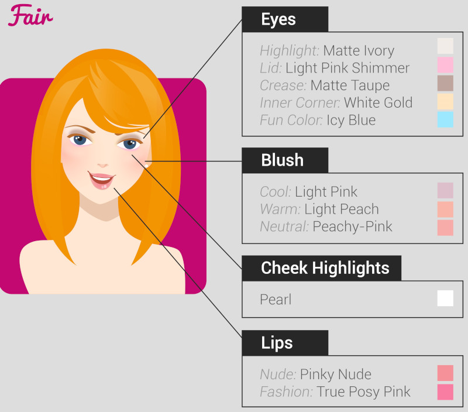

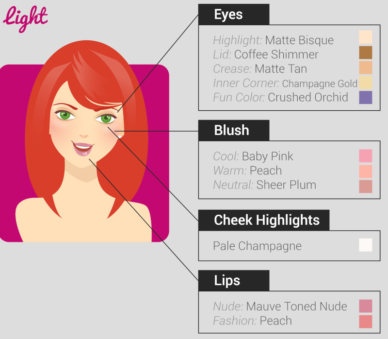

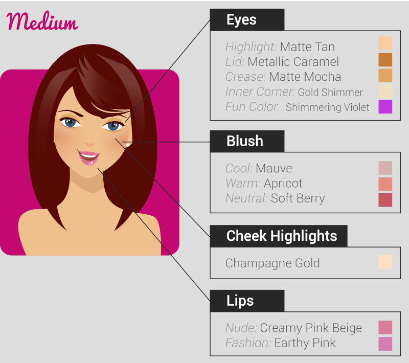

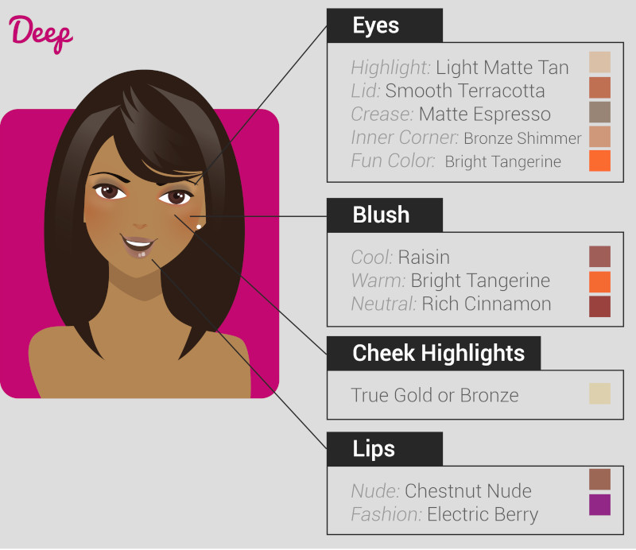

Your skin color is going to play the major role to determine the colors you will use, but you do need to find your skin's undertone and it can be different for various skin tones. Skin's undertone is the color that resides beneath the top layer of your skin and is slightly visible. There are multiple ways to test your skin's undertone, you might want to find exact guides on this topic, but a common way is to put on a pure white t-shirt and stand in a natural light in front of a mirror. If your face looks bluish or pinkish compared to the white t-shirt, then your skin's undertone is "cool". If your face looks yellowish, then you are most likely having a "warm" undertone. If you don't seem to look good when wearing white clothes, but don't appear to be bluish or pinkish, then you are possibly a "warm" skin's undertone. If you find that you can wear off-white (gray, caramel) color clothes and white color clothes without looking washed out, then it is possible you are a "neutral" undertone. If you notice that you appear slightly greenish, then you might be an "olive" undertone. Below you can find a comparison between various skin's undertone:

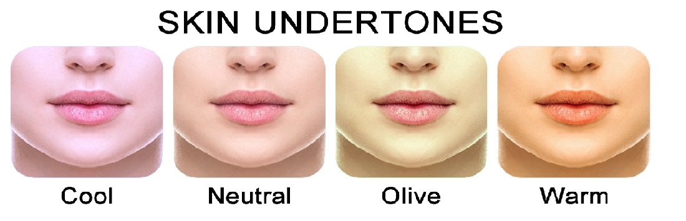

Note: Choosing your makeup color based on your skin is only one method. You can match colors based on specific features, for example, match makeup colors with your outfit or match your eyeshadow with your lipstick.

In general, there is a certain order how you should apply your makeup, but this is not definitive, you can easily change your makeup application order (to some extent) to achieve a different kind of look. The order you apply your makeup is important, but as long as you follow a few simple principles, you can adjust your look to your own liking. 

# Lighting

Before we jump into actual makeup application, there is a very important aspect that can change dramatically your makeup application decisions and the resulting look, this all can happen due to lighting. Below you can find some examples of light you should avoid:
- Fluorescent lighting, can easily make things appear too bright and you tend to use too much concealer/foundation
- Yellow lighting, can make you look tired
- Pink lighting, can make you miss blemishes
- Upwards/downwards facing lighting, tends to create all creases and wrinkles much more visible than in natural lighting

To have proper lighting, consider using natural light, but that might not be an option always. The alternative is to use warm white bulbs, something that is in the 4800K-5000K range is preferred. The best light sources are going to be mirrors that have well diffused light coming from various sides of the mirror. Below you can find an example of such a mirror that is suited for makeup application:

There are mirrors that have lightbulbs installed around the mirror, these mirrors do work too, but the light is not diffused. Such mirrors are good enough for most people so you can easily install such lights in your bathroom yourself.

There are also portable illuminated makeup mirrors, they can be used to, but you must make sure that your mirror is somewhere in the middle of your eye level. Below you can find an example of such portable mirror:

# Products

Below you can find a list of products you can use and a little comment what it does (order of the list matches the order you are supposed to apply each product):
- Primer, used to even out the skin's texture to make sure your makeup stays on
- Color corrector, used to hide very noticeable skin's imperfections, most commonly acne
- Makeup sponge, used to blend your makeup
- Foundation, used to even out the skin tone
- Concealer, used to hide skin's imperfections that a foundation cannot hide
- Highlighter, used to make certain areas brighter
- Contour, used to make certain areas darker
- Brushes, makes application of makeup easier, if used properly
- Powders, various powders achieve various look and serves a certain function
- Bronzer, used to make your cheekbones tan-colored
- Blush, used to make your cheekbones flushed-colored
- Eyeshadow, used to create a gradual color change on your upper eyelids and eyebrows
- Eyeliner, used to create a shape around your eyes to enhance the look
- Mascara, used to give your eyelashes more volume
- Eyebrow products, used to shape your eyebrows and give them more color
- Lip products, gives color, shape and certain finish to your lips
- Setting spray, used to make sure your makeup stays in place

Note: Most of these products are optional and some of them can be replaced with other products or combined products. The bare minimum usually is foundation, some contour along with highlighter, mascara, but even these products can be skipped or replaced, it is all based on personal preference and requirements.

Follow the guide to understand how each type of product can give you a certain result and how some of these products can be replaced with a different kind of products. Some products are not listed since they fall into one of the listed products, but there are some special products that don't fall in any category.

Note: Some people use certain products for a complete different purpose, you should keep in mind that makeup is less about functionality and more about appearance and for this reason you can play with the colors of the products more than their functionality. For example, you can even use eyeshadow to contour your face, but it will have some drawbacks. You will find such possibilities throughout the guide.

# Primer

Primers are the first step of the makeup process, the purpose is to level out small bumps and imperfections on your skin to make the skin as smooth as possible. This is usually done with products that contain silicone, but other ingredients also achieve this effect, silicones are the most common ingredient in primers. If you apply primer on your skin, you can expect your makeup to stay on longer, this is useful if you need your makeup to stay on the whole day.

It is possible to skip the primer, but without a primer it might be harder to put on your makeup and it will not stay on for very long period of time. Primer is not needed for everyone, most people will be using a sunscreen, they usually contain silicones and therefore can be used as primers for your makeup too. If your sunscreen does not contain silicones, then you can still experiment without using a primer since there are other ingredients that have similar properties.

If you do want to achieve the best possible makeup, then you should use a primer. Follow the instructions on your primer's packaging, but usually it involves getting a few drops of the liquid and rubbing it on your face, usually there is no need to wait for it to settle down. Some primers can be used on your eye area, but some can be too harsh. Read the instructions of your specific primer to make sure it can be used on eye area.

There are special eyelid primers that are specifically meant to be used on the eye area, but you don't have to get a dedicated primer for your eye area, if your face primer can be used on eye area. Consider getting a primer that is safe for eyes in the first place. Without priming your eye area, there is a large chance that your eye makeup will not stay on.

# Color corrector

While primer creates a smooth surface, it does not hide visual skin imperfections. Color correctors are used to hide some very noticeable imperfections, usually acne or hyperpigmentation that foundation nor concealer can hide, a color corrector is a concealer with more noticeable colors. The color of the corrector indicates its primary usage. Consider the following list:
- Green, hides redness on your skin, usually acne
- Orange, helps to conceal uneven skin tone for darker skin colors, especially for dark circles under eyes
- Pink, help to conceal dark circles under eyes for lighter skin colors
- Yellow, helps to hide veins, bruises and undereye circles
- Purple, helps to even out very dull skin complexion

Use the following diagram to decide what color corrector you need:

*TIP:* A pink or red color corrector can be used to conceal beard shadow and make it a lot less visible.

Color correctors come in liquid or powder form. Liquid color correctors will tend to have better coverage, but powder form color correctors might be more forgiving for acne. A liquid color corrector does not need any brushes (though you can use brushes too), but powder color correctors need brushes.

To apply a color corrector, first determine the required color to counteract the skin's imperfection color. For example, if you want to hide a few red pimples, then use a green color corrector, apply a small amount on that area and use your fingers or a makeup sponge to blend in the color corrector to match your skin as best as you can. Don't worry about it not being perfect because you are going to hide small imperfections later.

# Makeup sponge

While you can apply makeup without any brushes or sponges, the makeup sponge is almost critical to your makeup. The purpose of makeup sponge is to blend your makeup, but you will soon notice that using fingers to blend your makeup has a very limited effect, this is where a makeup sponge can be a gamechanger, some consider it as the most valuable tool in makeup. Consider getting just about any makeup sponge, the price will not matter much, as long as it looks something like this:

There are multiple types and varieties of this tool, but this guide will cover only this (the most common) version of the makeup sponge. To use the makeup sponge, pick it up, wet it a little bit so it is just slightly damp, so simply squeeze out any excess water. Do a "Dot&Dab" motion on the areas you want to blend, start by "dotting" your makeup into your skin, especially into hard to reach areas (like your eye corners), then you can use a "dabbing" motion on larger areas to give the makeup an overall natural look. Consider looking up videos that show the usage of this tool, a video example will be given further in this guide.

Note: There are other motions that you can use, for example, a circular motion starting from the middle on your face. The direction and motion you choose to use can make a big difference to the overall look. Experiment with various motions to see which one works for you the best.

**IMPORTANT:** These makeup sponges do get dirty, consider washing them with soap frequently. Not only a dirty makeup sponge can ruin your look, but it can also cause you acne.

Usually the makeup sponges have a teardrop shape, this is on purpose. The rounded bottom area is used to blend large areas, for example, your cheekbones. The flat tip area is used to blend very hard to reach areas, for example, the inner eye corners. The rounded tip area is used to blend somewhat hard to reach areas, for example, undereye area. If you find areas, where you cannot seem to blend or you cannot seem to get a proper blend, then consider looking for a different shape of makeup sponge, each shape has benefits and drawbacks.

# Foundation

Foundation is considered as the base for your makeup, it has the purpose to make your skin as even as possible to hide small imperfections and create a general skin tone, in fact you can use foundation to change your skin tone to some extent. The most difficult part of choosing a foundation is to "guess" your skin tone, sadly most companies use their own numbering and naming methods so there is no foolproof way to determine the color of the foundation you need to use. Luckily you don't need to get it perfectly right, this is where the makeup sponge comes in handy as it can blend your makeup to match your skin, especially the areas where your foundation is not used, for example, neck.

The way you are supposed to choose your foundation is to go to a store and place a small amount on your skin (preferably on your face since skin tone for your face and body can be different) and check the mirror. If it matches your skin color, then you have a match, otherwise it might look odd on you unless you are going for a look that changes your skin tone. Buying online can be very tricky, some stores offer you to receive samples or some kind of chart, but other than that you simply must make the closest guess you can, do remember that printing out the chart or looking at the chart on your monitor does not give a perfect color representation, the actual color on your skin can (and most likely will) be different.

Note: Many people use BB creams or tinted sunscreens to hide their skin imperfections, these people can skip using a foundation, but these creams have a limited coverage, you will achieve a noticeably better coverage with a dedicated foundation.

Foundations come in liquid and powder form. Similar to color correctors, liquid foundations tend to give you more coverage, but powder foundation tends to be more forgiving to acne. They do create different types of looks too. Their application method does differ so read on to find which method you should use. There are also mousse, stick and cream (BB/CC), these foundations are similar to liquid foundation and their application method does not differ much, consider using mousse foundation if you are a beginner and want to  

Liquid foundations can be applied by simply adding a small amount on your palms and rubbing it on your face. Try not to use too much foundation and don't worry about getting a perfect coverage either, that is where the next product is going to be useful. Similar to color correctors, you should use a makeup sponge to blend in your makeup, focus on the areas, where foundation ends, usually the neck area. Blend these edges as best as you can with a makeup sponge so the transition looks even. Use the makeup sponge to blend the foundation starting from the center of the face to outwards of the face, this will create a more natural look. Another way to put on liquid foundations is to use a foundation brush, this will give you an even more natural look and better coverage.

Powder foundation can be applied using a foundation brush, use your brush rub in a small amount of foundation powder and apply to your face in circular motions. Start from the center of the face and gradually move in circular motions outwards of the face. This will create an even and natural look. You can use the makeup sponge to blend any sharp edges you might have.

You can achieve different kinds of looks with just the foundation, there are 3 main types of foundation finishes (and more types that fall somewhere between them), the following list describes the effect of each finish:
- Matte finish, create a smooth, shine-free finish, sometimes contain sebum regulating ingredients
- Dewy finish, create a glowy, natural, radiant finish, usually contain hydrating ingredients
- Luminous finish, a finish between matte and dewy

While you can choose any type of finish, it is highly recommended to choose the finish based on your skin type. Oily skin type should use a matte finish since the skin tends to create excess sebum and create extra shine for the face. Dry skin type should use a dewy finish to add a little bit of shine and hydration. Luminous finish would work the best for normal skin type. Liquid foundations tend to be with dewy or luminous finish, but powder foundations tend to be with a matte finish. 

Note: You can use a little more foundation on areas, where you need extra coverage. Men would benefit of using more foundation on their beard area to hide beard shadow.

Below you can find a video instruction how to apply liquid form foundation:

Below you can find a video instruction how to apply powder form foundation:

*TIP:* Consider picking the foundation's color based on your skin's undertone too. Sometimes you cannot find a single tone that matches your skin, you can try to mix two foundations together to create a new tone.

# Concealer

Foundation is used to give a general coverage to hide skin imperfections, but sometimes it is not enough and you need extra coverage. This is where concealer comes is, which is meant to hide more difficult imperfections. It is possible to apply a concealer before foundation, just like you would do with a color corrector, which is a concealer, but the general practice is to apply it after the foundation to reduce the chance of your makeup looking "cakey", which simply looks uneven. There are multiple types of concealers, but you should be aware of the following ones:
- Liquid concealer
- Cream concealer
- Powder concealer
- Stick concealer

Liquid and cream concealers are similar to liquid foundations when it comes to application, cream concealers are thicker and offer more coverage, you will need to blend the concealer using a makeup sponge just like you would with a liquid foundation, a concealer brush can be used to achieve more precision. Powder concealers are applied the same way powder foundation is, but a concealer brush should be used. Stick concealers can be a great tool for those, who don't use much makeup, they can be a very quick fix for your skin imperfection, they come in a lipstick-like shape and can be easily applied by coloring a certain area.

Most commonly foundation is going to be enough to cover most imperfections, but concealer is more commonly used to brighten your face, this is a task for a different product in your makeup routine (the highlighter), but concealer can also be used and seems to be a preferred choice for most people since a highlighter might not give enough coverage to hide dark undereye circles. For the reason mentioned, concealer should be used to achieve a very common look, where your eyes seem bright and youthful. Use the following image to correctly apply liquid concealer, though you can use this guideline for powder concealer as well:

From the image above you can conclude that you should form a triangle shape to achieve a youthful look, but pay attention that the concealer is placed on dot form, this is intentional to make sure you use less concealer, from there you can spread the concealer and then blend it in. You might need to use a bit more concealer on the undereye area, if you have dark circles under your eyes.

There are some areas on your face that you may wish to downplay. This is something a highlighter does, but a concealer can be used too. We are not going to cover these areas just yet, but they will be explained along with the effects a highlighter can make. For now, remember that you can try to replace either partially or fully your highlighter with a concealer since concealers will tend to be a little brighter than your foundation.

Note: You don't have to fully blend the concealer in when you apply it, but you do want to smear liquid concealers a bit so they have the proper shape you are after. You can fully blend everything after you are done contouring.

# Highlighter

Note: Highlighting is considered as a part of contouring, where you shape your face, but in scope of this guide highlighting is going to be separate since here we are going to discuss a downplaying feature of the highlighter that can be used to create more feminine effect for a face that deserves a separate chapter.

The purpose of a highlighter is to highlight, this is done by making a area brighter than your parts of the face, but this effect has another feature that can be used. Highlighting is a part of contouring and how to highlighting your face to compliment its shape is going to be discussed in the contouring chapter, here we are going to discuss downplaying certain features that you might want into your look. When highlighter makes an area brighter, it also makes this area look shorter (along with strategically placed darker areas), this feature of a highlighter is very useful for those who want to appear more feminine.

Note: Some of the areas you might want to highlight can overlap with areas that you are supposed to contour to compliment your face shape, this can create an adverse effect, but sometimes it can cancel out the effect of an unwanted feature as well. Experiment with various techniques to see what looks best on you.

Below you will find various techniques you can use to transform your face, ignore the face shape because taking the face shape into account right now is going to be too complex. The white dots represent areas, where you are supposed to use a highlighter to achieve a look.

The T-zone for males is more outwards, some females have a sharp curve on the T-zone, you can use a highlighter on this area to make the area appear smoother therefore more feminine:

The eyes for a male are usually smaller and more inward, this creates a sharper edge and creates a masculine look. Highlighter can be used to make this area appear smoother and make your eyes look larger:

Females tend to have a bit shorter area between lips and nose, highlighter can be used to shorten this area for those, who might have a larger gap between nose and lips:

Males tend to have a more pronounced chin area, especially the chin dip, highlighter can be used to make this area look less sharp:

Female cheekbones tend to be more plump, highlighter can be used just right under your real cheekbones to make them appear more plump, do keep in mind that this area requires more contouring to have full effect:

The nose is probably the most common complaint for females and they wish to make it appear smaller, highlighter can be a very powerful way to downplay the size of a nose, but it requires some more contouring to fully have the effect, for now keep in mind that you need to add highlighter to the sides of the nose and just a thin line in the middle of the nose:

Note: You can use a concealer to highlight these areas instead of a dedicated highlighter, but you might still benefit from using a highlighter on some areas since highlighters tend to be more reflective and therefore can have even more pronounced effect when it comes to downplay a feature.

There are multiple types of highlighters and each has its own advantages, here are only some of the most popular types:
- Stick highlighters, best for total beginners, simply draw the highlighter where ever you desire
- Pressed highlighters, these come in a set of multiple shades of a highlighter, can get you the most skin tone matching color
- Powder highlighter, lightweight powder usually used for a finishing touch of highlighter
- Liquid highlighter, the most common one and gives you the most color contrast

You might even be using two types of highlighters to achieve even more advanced makeup. You have be option to use, for example, liquid highlighter to downplay some of your facial features after you have used concealer or foundation, but then you apply a finishing touch with a powder highlighter after you have used setting powder.

Note: Some types of highlighters can be applied with just your fingers, but some require a brush, for example, a powder highlighter. You can use a contour brush to apply the highlighter, but for powder highlighter you might want to use a special fan brush.

# Contour
 
Note: In the scope of this guide, a contour is makeup product that creates darker areas on your face, but contouring is a technique that sculpts your face using both a highlighter and a contour. The actual product used for creating a darker shade can be almost anything that has such a color, similar to a highlighter you can even use a darker concealer. There does not seem to be a universal name for both contour and highlighter that is widely used, so be aware that a contour/highlighter can be anything that has color and sticks to your face. In this guide we will simply refer to a highlighter as something with a lighter color and refer to a contour as something with a darker color, these names might not match whatever your are searching for, but the actual process name (contouring) is used quite universally.

Along with highlighter, a contour is arguably the most powerful makeup tool that can change your look so drastically that you might not recognize yourself anymore. The idea of contouring is to create a visual illusion of facial features. When highlighter is strategically placed next to a contour, it can create a very powerful sculpting effect and this ability is crucial when achieving a certain look.

There is a certain standard when it comes to contouring, this is directly linked to your face shape, the majority will agree that longer faces should be made to appear shorter, diamond shaped faces should have a narrower forehead, square faces should be made rounder and so on. Luckily for you, there are countless guides that specifically target a certain face shape when it comes to contouring. To get an idea how to place both your highlighter and your contour, check the image bellow (darker areas are contour and lighter areas are highlighter):

Note: These diagrams tend to be very contradicting when it comes to the contour placement, it is best to experiment with various contouring methods.

As you might notice, some of the previous mentioned highlighting methods to hide certain facial features are conflicting with contouring methods, this is something you need to pay attention since it can disrupt the overall look for your makeup. Also, this is diagram is not a rule for all makeup applications, this is only a guideline. You might find that you want to sculpt your face differently in order to match your hair style, for example. You can use contouring spots from different face shapes and create your own sculpting guideline.

*TIP:* It is highly recommended that you look up a makeup tutorial video that is meant for your face shape contouring, for example, search for "oval face makeup contouring". You can find a large amount of tips about contouring that is specific to your face shape.

Most contouring guidelines will advise you to create a "triangle" shape on your cheekbones, this is a very powerful method that will arguably create the biggest different to your look since it has the power to create an illusion of the length of a face and its overall shape. This "triangle" is a bit hard to master since there are multiple ways to draw it, in general the triangle starts from your mouth area and goes up to your ears, but adjusting the length and height of the triangle can change the look dramatically.

To correctly draw the "triangle", you must first understand what exactly changes when you place the "triangle" on your face. The "triangle" will create an effect that will make your face look either long or shorter and you should adjust the triangle based on your needs.

To shorten your face, you need to draw the triangle starting from the top of your ear, point to the very end of your nostril and end up somewhere in the middle (or bottom) of your ear. The triangle should end somewhere in the middle of your eyes. Sometimes this is done with a bronzer and applied with a sweeping motion towards the middle of the face, but this can be done with any product that acts as a contour. The thickness of the "triangle" will also have an effect (hence the option to choose the points on your ear), a narrower contour line will appear to have less effect than a thicker "triangle", you must choose the thickness of the "triangle" based on how much you want to sculpt your face. Check the image bellow:

To elongate your face, you need to draw the triangle starting from the middle (or top) of your ear, point to the very end of your mouth and end up to the bottom of your ear. The triangle should end somewhere in the middle of your eyes. Check the image bellow:

Note: Elongating the face might not be suitable for diamond shaped faces since this method will accentuate the small chin even more.

Similar to highlighter, almost anything can be used as contour. As long as it has a darker shade, it can be used for sculpting your face. While bronzers and blushes can be used, they deserve a separate section as contouring with them is a bit different. For contouring you can use a concealer, foundation, eyeshadow and most likely some other products. The application method will depend on the type of product, but in general liquid type of contour should be put on in forms of dots and then smeared to fill the shape, powdered types of contour should be put on using brushes.

One of the hardest things to master is to contour the nose. The common practice is to make the nose appear smaller, this can be done by strategically placing highlighter and contour. To make your nose appear smaller, you apply a thin line of highlighter in the middle of the nose, then draw 2 contour lines on the front of the nose. The darker lines will create an illusion that the nose ends faster, as a result the nose appears narrower. Do note that this only creates an effective illusion from the front view, not from the sides. Check the image bellow:

Note: This is the most common way most people contour their nose, based on your nose shape it might not be the best way. The straight lines on both sides will make your nose appear longer, check the guide further to learn more about nose sculpting using makeup.

*TIP:* You can enhance the effect of making nose more narrow by spreading the highlighter from the undereye area up to the sides of the nose to almost meet with contour lines on your nose. This can make your nose appear even narrower.

The shape of the nose is quite unique to everyone, in general you want to make it look smaller, but there are other characteristics that you might want to downplay or maybe even enhance. Consider the following image to follow how to contour your nose based on its shape:

When you have placed your highlighters and contours where you want them, then it is time to blend it all in. The process how to use it has already been discussed in this guide, but as a refresher, you are supposed to use slightly damp makeup sponge and using dotting and dabbing motions to blend the makeup together. Here is a video example that shows the process in quite good details:

# Brushes

As we progress through the makeup application routine, we see that makeup brushes are used in a few steps, but to you it might seem that at this point you don't need brushes to apply makeup. While you can apply your makeup with just fingers and even use your fingers to blend it in, your fingers are very limited when it comes to creating a natural makeup look. Even if you did manage to put on your makeup with just fingers, it is going to get a lot more complicated in further chapters without using makeup brushes.

There are a wide variety of makeup brushes, it might not even be possible to list them all since there probably is a brush for each type of makeup look, below you will find some very common brushes that you might want to incorporate into your makeup routine.

**Powder brush** is used to apply your makeup that is in powder form, but due to its size it is usually limited to applying powder foundation or setting powders. More dense bristles will give you more coverage when applying a powder. Below you can find an example:

**Blush brush** is used to apply blush on your cheekbones, it is usually very similar in size and shape to a powder brush, but tends to have a more "dome shaped" soft bristles. A small and dense brush will create a "pop" effect for your cheeks, a medium dome shaped brush will create a more subtle effect, but an angled blush brush is going to give you the most natural look. Below you can find an example (dome-shaped on the left, angled to the right):

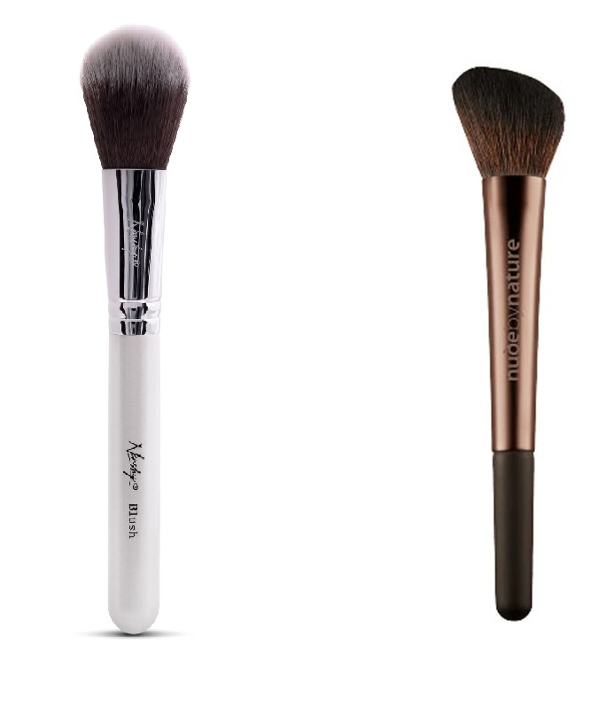

**Contour brush** is used to apply your contour, but there are multiple shapes of the brush and each shape has its own usage. The most common contour brush is wide (sometimes fan shaped) and used to apply contour on your cheekbones, jawline and other places where you can draw straight lines, but a concentrated brush will be more useful for smaller areas. There are also angled contour brushes that tend to give a more natural look. You can use concentrated hard bristle brushes to apply a liquid form contour. The fan shaped brush is usually used to apply bronzer. Below you can find examples of a contour brush:

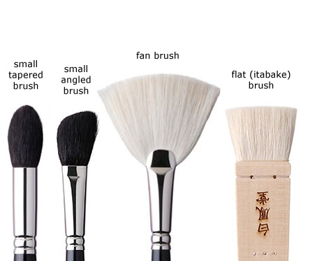

Note: These brushes can be used to apply highlighter as well, make sure you clean them properly before using your next product!

**Concealer brush** is used to apply your concealer, it is recommended to use synthetic bristles rather than natural bristles since natural bristles are harder to clean. You can use to spread your liquid concealer with these brushes since they tend to have harder and more concentrated bristles than other brushes. Below you can find an example:

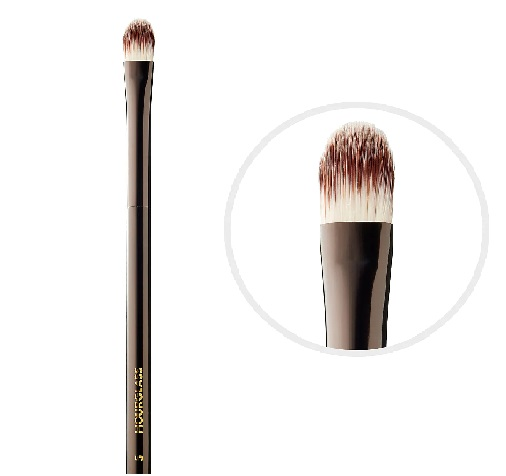

**Eyeshadow brush** is used to apply eyeshadow, but they come in large variety. A Flat eyeshadow brush is concentrated and stiff, will give easily layer your eyeshadow on the flat parts of your eyelids. Dome eyeshadow brush is less stiff, but the dome shape gives you the ease to apply eyeshadow into creases. Blending brush helps you to blend eyeshadow more easily. Pencil brush is used to apply eyeshadow on your inner eye corners since it requires a lot of precision. Angled eyeshadow brush is used to create a shadow line above your lashes. Bellow you can find examples of the various eyeshadow brushes:

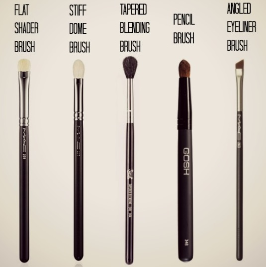

**Lip brush** is usually used to apply your lip gloss, the tapered brush gives you precision to apply your lip makeup and waste less actual product. These brushes are mostly used on some liquid form of lip makeup. Below you can find an example:

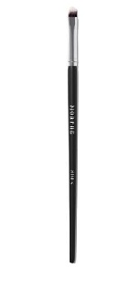

**Brow brush** is used to apply your eyebrow products, some products come with their own eyebrow brush, but some pomades, powders and gels will not come with a brush. These brushes usually come with 2 sides, one side resembles a mascara comb, but the other is a flat tapered brush. The comb part is used to comb your eyebrows and apply makeup on them, but the tapered part is used to draw your eyebrows and give them more distinct shape. Of course, these can be two separate brushes as well. Below you can find an example:

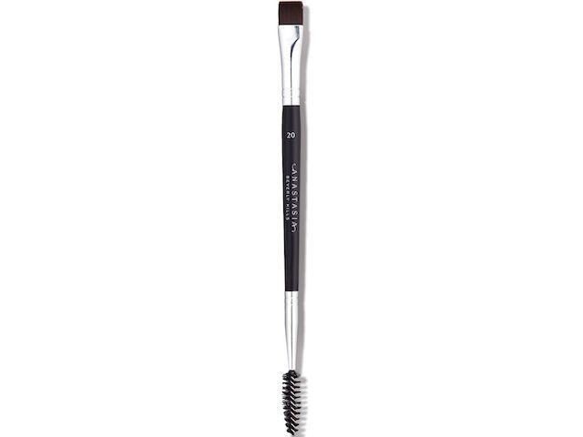

Note: There are many, many, many more brushes, but as you might have noticed some of them are very similar. In fact, you are very likely to be able to use the same brush for multiple purposes.

**IMPORTANT:** Makeup brushes need to be cleaned, often! You should wash your brushes at least once a week with lukewarm water and gentle (non-scented) hand soap. These brushes tend to gather bacteria that can cause you acne. These brushes also tend to gather excess makeup material and cause them to be more stiff or loose their shape, this will greatly impact the quality of your makeup. There are special cleaners for your makeup brushes as well.

These brushes come not in just various sizes and shapes, but also in various prices. We are not going to discuss the true value of expensive brushes, there are reasons why some brushes cost a lot more. There are claims that expensive brushes have a great effect on the overall result, but there are also opposite claims. It is your choice. Do keep in mind that if you are a beginner, then buying professional tools will not make you a professional, you still need to practice your skills. Some brushes tend to be more expensive because of the natural bristles, but there are cases when synthetic bristles are more desirable, one case is mentioned above. If you are on a budget, consider getting a cheaper set of brushes, but as your skill grows with practice, you might want to give some more expensive brushes a try.

# Powders

Powders give your makeup a nice finishing touch, but some powders have a distinct function, though most powders will have a similar function. Below you can find a list of most common powders and their use case:
- Setting powder, used to "set" your foundation and contouring in so it stays in place throughout the day, some of these powders get rid of shine
- Finishing powder, used to conceal fine lines and pores, they tend to be with a little whitish color (don't over do it), gives you an airbrushed look
- Loose powder, used to create a little bit of coverage, is quite messy to use since it is a powder in loose form
- Pressed powder, used as a touch up powder to conceal small imperfections on the go
- Translucent powder, a colorless powder that removes shine from your face without changing the color of your contour or highlighter, creates an even look, similar to a finishing powder

As you can see, some of the powders essentially do the same thing, but can have a slightly different effect. Each manufacturer specifies what kind of effect does their powder create, it can be a mattifying effect or dewy effect, it can be a colorless or tinted powder. The idea of the powder is to create a finishing touch, the choice of the powder will mostly determine the finish of your makeup. You probably can layer multiple powders, but be careful to not create a completely lifeless look due to a thick makeup layer.

The way you apply your powder is by a dotting motion to prevent the powder getting too deep inside your wrinkles and pores. Check the video instruction below:

Note: Some powders come with their own cotton disk, this is meant to be used instead of a brush, but keep in mind that a dedicated brush can give you more precision when you apply the powder. The cotton disk is great to apply powder on large areas in a little amount of time.

# Bronzer

The purpose of a bronzer is to create sun-tanned spots on your face, this usually is done on same areas, where you apply your contour, but you can mix both contouring with bronzing to create a tanned-like skin throughout the year. Bronzers come in two very different styles:
- Shimmering, creates a shine, not suitable for areas where your skin is already shiny (due to oily skin), should not be used throughout your face in large quantities as it can create too much shine
- Matte, creates a matte effect, great for contouring your face, does not create shine
- Sheer, a middle ground between shimmering and matte bronzer

As with other makeup products, bronzer too comes in various forms, they can be liquid, powder, cream and other forms. Choose your bronzer type based on your personal preference as powder bronzers will give less coverage, but cream bronzers will create more coverage. Be aware that creating too much tanned-like skin on certain areas only will make your makeup look a lot less well done.

To apply your bronzer, you must use a brush and the selection of the brush is going to be based on the type of bronzer you have picked. For shimmering bronzers consider using a wider and less dense brush, a foundation or fan brush will be good for this purpose. For matte bronzers you can use a contour brush and create more concentrated bronzer lines. Bellow you can find an image of a shape you can use to apply the bronzer:

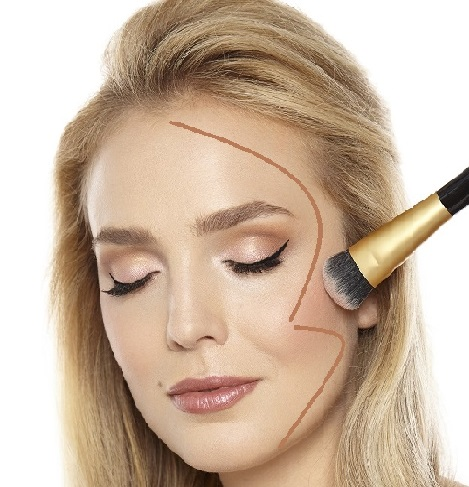

Note: These bronzer lines can interfere with your contouring, as a result your attempts to sculpt your face might be counteracted with a bronzer. Consider not using bronzer on areas, where you have not used a contour. 

*TIP:* A bronzer is quite commonly used as contour, but mostly matte bronzers are used for this purpose. Shimmering bronzers can be used too, but you should apply it starting from the center of your face and draw straight lines towards the side of your face.

Below you can find a video instruction how you can apply a bronzer:

Note: Bronzer is usually applied after using finishing or setting powder, this is because applying powders after you used a bronzer can make the bronzer appear smeared. Consider applying the bronzer after your powders to create more defined look.

# Blush

Blush is used to add color to your cheeks, this creates an illusion that the face is lifted and more younger looking. It comes in a wide variety of red shades to create a look you are after. Similar to other makeup products, blush comes in various forms, such as powder, cream, liquid, stick, pressed powder and other forms. Choosing the right blush is a personal preference, the powder form will give you the most natural look, liquid forms will give you more precision, but will create very defined lines, that might not look very natural and needs some blending to be done.

Note: Blushes are supposed to be applied after your setting powder or finishing powder, but if you use liquid form blushes, you might want to use it before your finishing and setting powder to make it look more blended in with the other makeup. Powder form blushes create a light touch of red tone that does not need to be blended and in general will stay on even if you put it on after your setting powder, but this is something you might want to experiment.

There are many ways you can apply your blush, each method has its benefits and gives you a different kind of look. Similar to a bronzer, applying a blush will interfere with your contouring. For the mentioned reason you might benefit the most by applying blush based on your face shape. Blush will bring a lot of attention to itself so putting plush on your contour spots might make the most sense. Check the following image to determine possible blush placements based on your face shape:

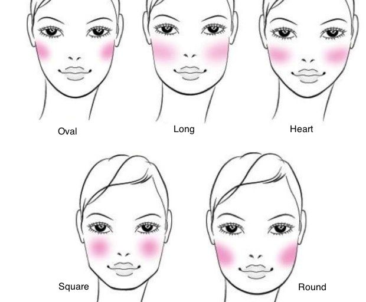

Based on your face shape, you can decide where to place your blush. If you place your blush directly on your cheekbones, you are going to create a more youthful look, but if you place more blush higher than your cheekbones and more to the outside of your face, then you are going to create a more lifted look. Based on these two looks you can create, you will generally have two methods how to apply the blush.

*TIP:* Consider picking your blush colors based on your skin's color. Check the [The look](#The-look) section.

The first way to apply blush is using a natural smile. You simply smile (don't exaggerate) and place blush directly on the "apples" of your cheekbones that are now clearly visible. Use your blush brush (an angled brush is most suitable for this), pickup a small amount of product and apply it to your cheekbones lightly (don't use it too much at first) in circular motions and spread lightly towards your ear. Check the video instruction below:

Note: While you are smiling, your "apples" of your cheekbones are higher up, but they are lower when you stop smiling. This is not an issue for young people, but for older people this creates an illusion that the face is saggy. Consider not applying your blush directly on the "apples" of your cheekbones, if you don't have a very well sculpted face, with no wrinkles and so on.

A much more suitable blush application method is to apply it to your actual cheekbones that are right under your eyes. In this method you should not smile and you should keep a very neutral face. For a round shape face you find your cheekbones and start applying your blush starting from a line that crosses somewhere in the middle of your eyes and sweep upwards to your upper earlobe starting from your cheekbones. For square faces you similarly start from a line that crosses the middle of your eyes and apply blush more on your cheekbones and then sweep upwards to your upper earlobe, more blush should be concentrated on the "apples" of your cheekbones. For oval and long faces you start from a line that crosses the middle of your eyes and sweep in a straight line towards the center of your face. Check the video instruction below:

Note: You can use a contour, a bronzer and a blusher and it does create a very well sculpted look, if done properly. You should apply your contour first, then apply your bronzer and then apply your blusher above the bronzer. 

# Eyeshadow

Eyeshadow is used to create depth for your eyes, compliment your eye color, draw more attention to them, make them appear bigger or smaller. It is a very powerful tool to enhance your look and mastering it can be quite hard. Similar to other makeup products, eyeshadow comes in various forms, they can be in powder, cream, liquid, mousse and pencil and other forms.

Note: Using eye primer (or primer that can be used on your eyelids) will make it easier to apply eyeshadow and will make sure it sticks to your eyelids for longer periods of time. Simply apply a small amount of your primer to your finger tips and apply it on your eyelids in a dotting motion.

Eyeshadows come in various finishes and it can have a great effect on the overall look. There are many finishes and each brands seems to market their finishes in their own names, but here are some common finishes that you might be interested in and what kind of effect does it have on your overall look:
- Matte, a classic finish that is well suitable for all ages, especially for mature skin since it will not draw attention to wrinkles
- Metallic, creates a very shiny finish that makes all fine lines very well visible, resembles gold, silver or other metals depending on the color
- Shimmer, a very subtle amount of shine
- Glitter, usually requires a tacky base, it looks like glitter on your eyes, not suitable for mature skin

*TIP:* Consider picking your eyeshadow colors based on your skin's color and skin's undertone. Check the [The look](#The-look) section.

Another way to pick your eyeshadow colors is based on the skin's undertone. Below you can find some recommendations how to match a skin color, an undertone and an eyeshadow:
- Light skin with warm undertone: dull bronze
- Light skin with cool undertone: washed out copper
- Medium skin (usually warm): gold, cinnamon, warm red
- Olive undertone: teal
- Tanned skin (usually neutral): try anything!
- Dark skin: bright metallic colors

It is possible to buy either a single color eyeshadows, they are useful when you know exactly what color you need and a single eyeshadow color is cheaper, but if you start to use multiple colors, then you will not some kind of compartment to manage them and the price for multiple eyeshadows quickly add up. More common option is to get an eyeshadow palette, they can include anywhere from 2 to even 30 colors (or maybe even more) and you can even mix multiple colors to create your own unique color. Eyeshadows come in various price ranges, the price will not directly reflect the quality of the eyeshadow. The difference between a good and a bad eyeshadow is that good eyeshadow blends well, spreads easily, has a strong pigment, lasts all day and does not irritate your skin or your eyes.

Note: Mature skin has fine lines around the eye area, these fine lines can make applying eyeshadow (and other makeup products) harder, you should use a primer on your eye area, but you can also apply a concealer to reduce the appearance of fine lines and make the eyeshadow application easier.

Some people have smaller eyes than other people do, depending on your look, you might want to either make them appear larger or smaller. Men tend to have smaller and deeper eyes, so to achieve a more feminine look they should avoid using dark colors for their eyeshadow, consider using light tones and apply slightly darker tones on the eye creases. To make eyes look smaller, you should use darker colors, especially right around your eyelids where you would put your eyeliner.

The actual application of an eyeshadow can be made very complex using 12 different brushes, multiple layers of eyeshadows and a lot of blending, though it can be made simple. There are many techniques for you to use, but mostly they are unique to each person, for this reason we are going to look at a common and basic method how eyeshadow is being applied. Start by applying your primer, then apply a neutral color using a medium eyeshadow brush, this is something between the darkest color and the lightest color you have chosen to use. After you have a neutral color as your base, use an eyeshadow crease brush and blend in a dark color into your eye's crease, start with a little amount of product on the inner corner of your eye and increase the thickness of the crease line gradually as you move along to the outer corner of your eye, remember to blend the darker color into the base color as much as you can using the crease brush, the eyeshadow crease creates a dramatic look for your eyes that always looks flattering. You should extend the darker color or even use a different dark color to the outer corner of your eyelid. Optionally you can apply a highlighter or a light color eyeshadow above your eyes up to the brow bone (no on the brow bone) using a blending brush. Apply a light color in the inner corner of your eye lid, use a pinky finger here instead of a brush to make it look more natural, press lightly so you don't apply too much color. If needed, use a blending brush to create a more even look between different colors.

Below you can find a video tutorial that uses a very similar eyeshadow application method:

Like mentioned above, the techniques are almost countless, so the best approach is to find a tutorial on your own that matches the look you are after. Below you can find common eyeshadow looks that you can get an inspiration from:
- Natural
- Shimmery
- Cat-eye
- Gradient
- Halo
- Cut crease
- Smoky eye

*TIP:* If you don't have a great eyesight, then you might have troubles applying eyeshadow. Consider using a magnified makeup mirror.

# Eyeliner

The purpose of the eyeliner is to draw more attention to your eyes, either by enhancing them or by changing their shape. Mastering eyeliner is probably going to be one of the hardest tasks in makeup since it requires a lot of practice. Feel free to practice eyeliner at every moment you can. There are 4 main eyeliner types and all of them can be either waterproof or non-waterproof:
- Pencil, comes in a sharpenable or in a retractable form
- Cream 
- Gel
- Liquid, comes in a pen shape or bottled brush tip shape

Each type of eyeliner has its own benefits, but have some drawbacks as well:
- Pencil eyeliner is best for beginners, easy to use, cheap, but cannot create a sharp line
- Cream/gel eyeliner, cream eyeliner is thicker than gel eyeliner, possible to create a smooth line, a bit easier to use than liquid eyeliner, glides smoothly, but they require an eyeliner brusher and can be more expensive
- Liquid eyeliner creates the sharpest line possible, but can be very hard to apply it and hard to fix mistakes

There are many colors available for the eyeliners, but you are mostly going to be interested in either black or brown eyelines (depending on your lashes) and in a white eyeliner. The white eyeliner is useful create an illusion of larger eyes that is especially useful for those, who want to create more feminine looking eyes. The technique is quite simple, you use a white pencil eyeliner and apply a very thin line exactly on the top of your lower eyelid, check the image below to better understand the white eyeliner placement:

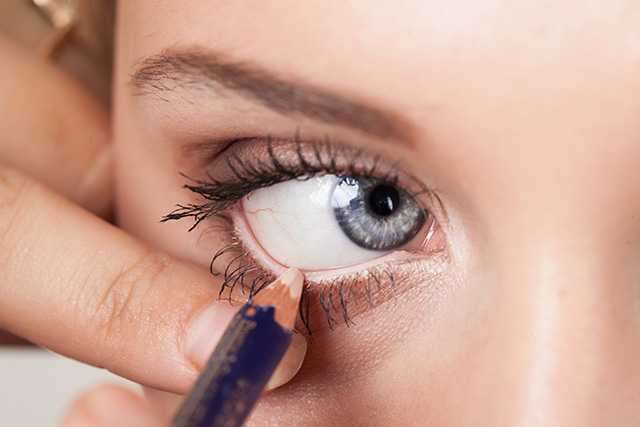

*TIP:* Apply your white eyeliner to the inner corner of your eyes to make them appear even larger.

There are many techniques how to apply eyeliner on top of your upper eyelashes, this technique can be used for all types of eyeliners and you can easily adjust it to create your desired look. Start by taking your picked eyeliner and apply a steady line above your eyelash on the outer half of your eye. You can rest your elbow on the table to increase precision. Close one of your eyes and create short strokes starting from the middle of your eye to the outer corner of your eye, you can increase the thickness as much as you want. Extend the line you draw each time, but don't go too much further from your actual eye corner, this will create a natural looking extended eye. Fill in all the gaps you have between eyelashes and between your eyeliner. See the image below to see an example how the outer part of your eye should look:

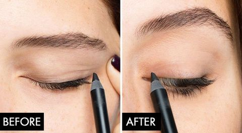

Note: Avoid extending your eye line at this point, creating the "winged-eye look" should be done after the base part is drawn. If you extend the drawn line too far at this point, you will make your eyes look tired

When the outer part of your eye is finished, repeat the process for the inner part of your eyes. Use short strokes from the inner corner of your eye and draw a line to the middle of your eye. Try to keep this part of eyeliner thinner then the outer part of your eye. Fill out the gaps between eyelashes and between your eyeliner. The eyeliner should be very thing on the inner corner of your eye and become thicker to the outer corner of your eye. Use a Q-tip to fix imperfections you have made with your eyeliner.

*TIP:* You can use a Q-tip to smudge the eyeliner and create a "smoky look".

Note: You can apply a dark eyeliner on the lower lid of your eye to create a dramatic look, but this can make your eyes appear smaller. Also the lower lid's eyeliner must be very thin.

The most common look that most people are after is the "winged-eye look" that creates an extension of your eye to your eye's corners. This is a very tricky look to create as drawing the wrong shape can result in making the eyes look tired. To prevent this you must use a very sharp liquid eyeliner and choose the correct angle. The common practice is to use your lower eyelid's natural curve to draw the extended eyeliner and then connect the top part. Avoid making the wing too thick and too long, experiment with subtle sizes first. Check the image below to see a trick that can be used to learn to draw the wing:

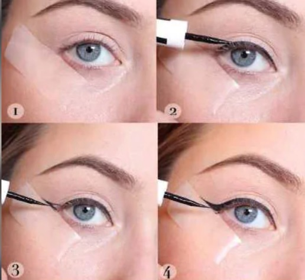

*TIP:* If you don't have a great eyesight, then you might have troubles applying eyeliner. Consider using a magnified makeup mirror.

There is an option to get permanent eyeliner, this is done by tattooing the eyeliner on your eyelids. You can get a traditional eyeliner tattoo that is just a line on your eyelid, or you can get a lash enhancement tattoo, which makes your eyelashes to look fuller and more natural than the traditional eyeliner tattoo. Permanent eyeliner can only be done professionally. A specialist will explain the procedure and guide you through so you can make a proper decision.

# Mascara

Mascara gives your eyelashes more volume, lengthen them, thicken them and adds color to them. Females tend to have longer to compensate the larger eyes than males, but most women still want to make them appear even larger and mascara is a quick way to enhance them and give an instant feminine look. While there are cream and powder form mascaras, you will mostly be looking at liquid mascaras and those are the most common you will see. Mascaras have different types of formulas and they tend to fall into the following categories by their effect:
- Lengthening mascara, adds extra fibers on the tip of your eyelashes, comes with a denser brush and requires multiple coatings of mascara, suited for those with short eyelashes
- Volumizing mascara, adds extra thickness to your eyelashes, usually contains waxes and silicones that stick to your eyelashes and don't change the shape of your eyelashes, suited for those with thin eyelashes
- Curling mascara, enhances the natural curve of your eyelashes, the consistency is very thick and can be hard to apply
- Lash defining mascara, a combo mascara that lengthens, volumizes and curls your eyelashes, but it also prevents eyelashes from sticking together, which makes this mascara suited for everyday use
- Non–clumping mascara, does not create the clumping effect many mascaras create, also adds a nice finish to them

Note: Mascaras are available in waterproof and non-waterproof formulas. If any liquid comes in contact with a mascara and it is not a waterproof one, then mascara will smudge. On the other hand, non-waterproof mascaras can easily be washed off, but waterproof mascaras usually come off with strong makeup removers that might irritate your eyes.

The application of mascara is something that is tricky, you need to practice a lot to get it right for your selected mascara. Luckily there are multiple mascara wands that are available that can help you with your application, you can find information about various available mascara wands below:
- Classic mascara wand, creates a more volumizing effect
- Tapered comb mascara wand, makes it easier to apply mascara on your inner corners of your eyes and more product is added on the outer corner, creates a cat-eye look, not good at volumizing eyelashes
- Curved comb mascara wand, creates more curled eyelashes, comb minimizes the changes of the clumping effect
- Micro wand, great for achieving a defined eyelash look, makes it easy to apply mascara on your lower eyelashes
- Fat brush wand, creates a doll-eyed look by making eyelashes more voluminous
- Precision tip wand, great for adding mascara for very tiny and hard to reach eyelashes
- Ball wand, creates the most coverage possible, but you need to apply mascara multiple times
- Ball tip wand, great for reaching small eyelashes
- Corkscrew wand, similar to the classic mascara wand, but creates good coverage and good volume
- Comb bristle wand, create a lot of volume and length, it also gives you definition for your eyelashes, creates a dramatic look
- Skinny wand, great for adding length and definition to your eyelashes, not great for volumizing your eyelashes
- Triple ball wand, creates a dramatic full coverage look by curling while you apply mascara

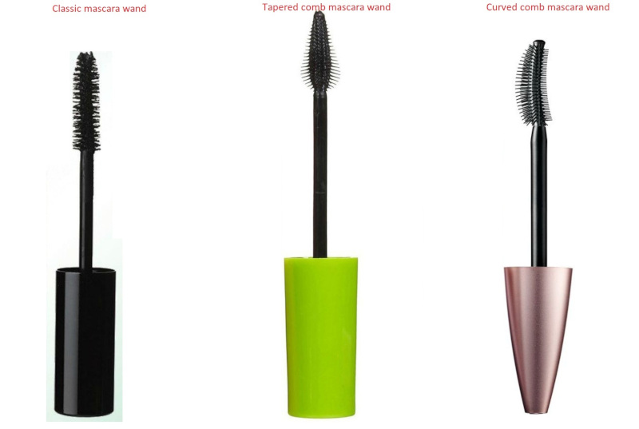

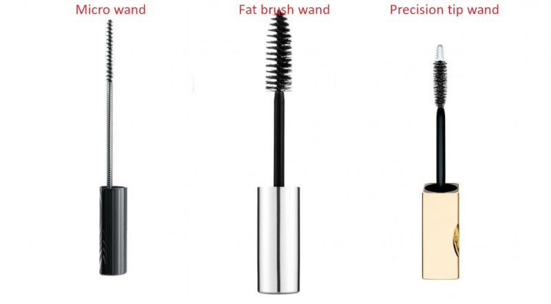

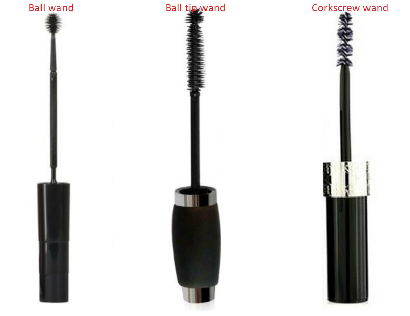

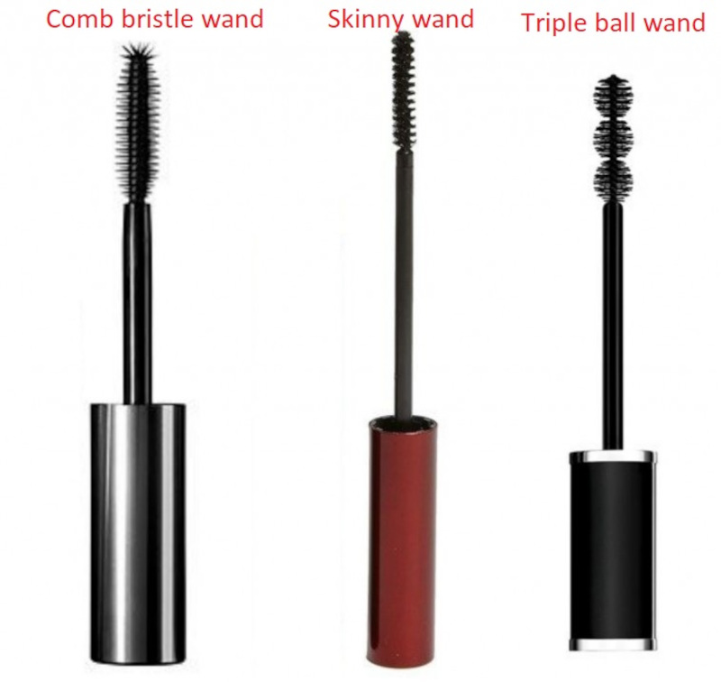

Note: Mascaras come in various colors, they can be black, brown and transparent. Consider getting a mascara that matches your eyeliner's color.

Mascaras are limited to what they can do when it comes to curling them, therefore you should consider using a separate eyelash curler. Such a device can make your eyelashes look longer, thicker and fuller. Using the device is fairly simple, just take your eyelash curler, place it as close as you can to your eyelids, press the curler for 5 seconds, then move away from your eyelids, squeeze the curler again, then move further away and squeeze it again for another 5 seconds to curl your eyelashes in all their length. There is a trick that you can use to make your eyelashes curl even more and stay curled all day long, this can be done with a hair dryer. Simply heat up your eyelash curler just a little bit before each curling eyelashes on each eye, but be very careful though, the eyelash curler gets very hot fast and it will feel a lot hotter on your eyelids.

Note: Make sure you have properly cleaned your eyelashes from previous mascara. It is possible that your eyelashes can fall out if you curl them with mascara on your eyelashes.

When your eyelashes are curled, you are ready to apply mascara on your eyelashes. This is the part that requires a lot of practice, but some people have discovered some neat tricks that can help. Take your mascara un take as least amount of product you can with your mascara's wand, wiggle the wand around the bottle to remove excess material from the wand. Place the mascara's wand to your eyelashes and wiggle the wand into your eyelashes from side to side. After that you can apply mascara to the tip of your eyelashes and this can be done by blinking your eyelashes into the wand. Apply your mascara also on your lower eyelashes by gently touching them with your mascara's wand.

*TIP:* Mascara smudges easily when you miss your eyelashes, there are mascara's applier guide tools that can prevent you from smudging your eye makeup.

Some people are not so lucky with their natural eyelashes and mascara with an eyelash curler is limited in its abilities. One solution is to use eyelash serums, but many of the advertised eyelash serums are not very effective without a prescription. To find a good eyelash serum you should look for one of these ingredients in them, some of them are still only available with prescription in some countries:
- Bimatoprost
- Latanoprost
- Tafluprost
- Travoprost
- Isopropyl Cloprostenate
- Isopropanol phenylhydroxypentene dihydroxycyclopentylheptenate
- Trifluoromethyl Dechloro Ethylprostenolamide

Eyelash serums work very slow, you can only see some results in 1 month and they are going to be very minimal at first. Another option is to use fake eyelashes, but as of now, this is going to be out of this guide's scope.

# Eyebrows

Eyebrows give your look a groomed look. Most people naturally will have thick, uneven eyebrows, which is not suitable for most makeup looks. You should start by trimming your eyebrows to make sure your eyebrow hairs are in even length. There are electric eyebrow hair trimmers that easily trim to a specific length, though most of them will not be very adjustable. Blow you can find an example of an electric eyebrow trimmer:

Note: Usually eyebrow trimmers are sold as facial hair trimmers as they are universal to cut facial hair, nose hair, ear hair and eyebrow hair.

Some eyebrow trimmers will have a eyebrow brush, in general it is not needed, but it is nice to have as you must comb your eyebrow hairs upwards to make sure you get an even cut. You can even take a comb out of an empty mascara or use a beard comb. After you combed your eyebrows, use your electric trimmer and trim your eyebrow hairs by trimming them against the hair growth direction. Be careful though, these trimmers can cut a lot of hairs off and you might not be used to short hair eyebrows, so it is better to test out the length and possibly use the longest setting first (if available). Below you can find a demo and a review of such a device:

Note: It is possible to trim your hairs using scissors and a comb, but this is not recommended for beginners, consider just getting an electric trimmer instead.

Some people have quite even eyebrow hairs, so they might not even need to trim them, but might improve the look. Another reason to trim your hairs is to make plucking your eyebrows easier. Plucking your eyebrows involves pulling out excess hair and to shape your eyebrows. Shaping your eyebrows is an art form and is best to get it done professionally, but if you feel adventurous, then you can try shaping your eyebrows at home. Usually eyebrow shaping is done based on your face shape, consider using the following image as a guide to choose your eyebrow shape:

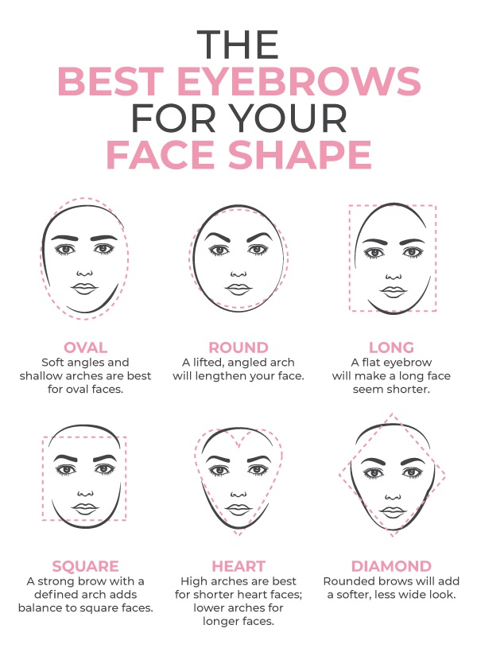

Note: Female eyebrows tend to be higher up than male eyebrows and many female eyebrows tend to be more curved. Female eyebrows tend also to be thinner and in the past it was considered that you must have thin eyebrows, if you were a female. As of year 2021, females have all possible eyebrow shapes and they are all considered feminine.

You must make sure you do NOT overpluck your eyebrows. There is a common way to make sure you don't overpluck them by using certain guide points. You can adjust it a little bit, but be very careful since it might create a weird outcome. Many women like separate the eyebrows even more and pluck more hair under the eyebrows to make them appear higher up to appear more feminine, but this can easily backfire. Consider using the following image as a guide to shape your eyebrows:

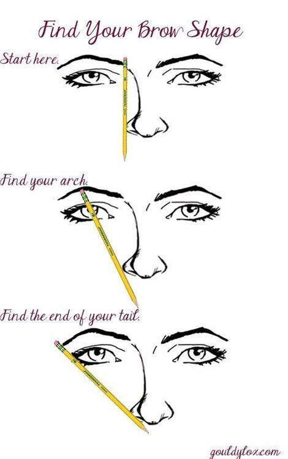

Use a pencil to draw a straight line, some people like to use a highlighter to put a mark on. To shape your eyebrows, pluck hairs that are between the pencil and your other eyebrow, then find the arch, which is the highest point on your eyebrow. The arch of your eyebrow is where it changes the angle, for very curved eyebrows this is where eyebrow shape starts to go downwards, for more straight eyebrows this is where your eyebrows stop increasing the height. As for the tail, this is where your eyebrows should stop. To pluck the hairs, use a pair of tweezers. There are many types of them, but a pair of flat ended tweezers will do just fine. Below you can find an example for a pair of tweezers to pluck eyebrows:

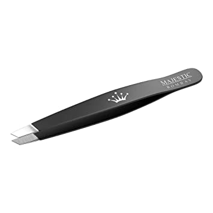

Note: Make sure you properly clean your tweezers before each use. Plucking hair (just like epilating hair) creates a small wound that is prone to infections. Consider using anti-bacterial lotion (such as aloe vera gel) to minimize the chances to develop acne in those areas.

**IMPORTANT:** Shaping your eyebrows is very difficult and many fail. Consider getting your eyebrows shaped professionally and then only maintain the shape by plucking excess hairs and trimming stray hairs.

Not everyone is blessed with perfect eyebrows, most people don't seem to have evenly distributed eyebrow hairs, some people don't have a deep color tone for their eyebrow hairs, some people don't have the shape of thickness for the eyebrows they want. To fix this, various eyebrow makeup products are used, below you can find the most common types of eyebrow makeup products:
- Eyebrow gel
- Eyebrow pomade
- Eyebrow pencil/marker
- Eyebrow powder

Eyebrow gel's main purpose is to secure the look of your eyebrows since the gel texture fastens your eyebrow hairs into place. Another feature of eyebrow gel is that they can be tinted, this means they can add color to your eyebrows and fill out the gaps. One of the best benefits of using a brow gel is that it is very easy to use and can be applied very fast, can easily be applied in 20 seconds for each eyebrow, the result is usually a very natural look. These gels can also be transparent, consider using less pigmented eyebrow gel first to understand the tone you need. They usually come with a comb and a spoolie. To use eyebrow gel, comb your eyebrow hairs upwards, use the spoolie to draw lines around your eyebrows and then fill in the middle. Consider combing your eyebrows upwards again before the gel has dried. Some eyebrow gels don't come with a comb, but just a spoolie, in such a case simply use the spoolie to comb your eyebrows in upwards motion. Below you can find a video instruction how to apply eyebrow gel:

Eyebrow pomade is a cream based product and is used to create very defined eyebrow shapes and to create dramatic looks since pomades tend to come in very concentrated colors, but can also be used to create a natural look. The cream based structure is great for mimicking natural hairs so it is great for filling in gaps. Since pomades are very concentrated, then consider getting a less saturated color. Eyebrow pomades tend to come with a brush. Many people like to use eyebrow gel to fasten their eyebrow hairs first and then use pomade to add more definition. Use an eyebrow brush that is very thin and flat and in upwards motions in small light strokes draw new eyebrow hairs wherever you feel you have hair gaps. If you want to create a very defined look, then you can use a pomade to draw lines around your eyebrow. To draw more defined eyebrows, start by dipping a very small amount of pomade with your flat eyebrow brush, then in very light strokes starting from about the middle of your eyebrows lower side start drawing a straight line outwards till you reach your eyebrow's arch. Continue to draw the line from the inner corner of your eyebrow towards the middle of it and connect the previous line. After that draw a line starting from the arch towards your outer corner of the eyebrow. Draw a line in a similar fashion for the upper side of your eyebrow. When both the upper and lower lines are drawn, then fill in the middle using a semi-circular light strokes upwards to create a more natural look of eyebrow hairs. Consider watching the following video instruction to better understand the process:

Eyebrow pencils/markers are a great way to quickly fill in gaps on your eyebrows and they can be also used to create very precise eyebrow line definition that is more precise than what you could get with a pomade. These pencils/markers can come in various sizes and you can choose depending on your needs. A larger sized pencil/marker will make filling large areas fast, but smaller pencils/markers will give you great precision and gives you the option to easily draw your own eyebrow hairs. Over time eyebrow pencils will not be sharp anymore, you need to sharpen them. Most pencils will come with twist cap that sharpens the pencil, but some don't and you will actually need to sharpen it using a pencil sharpener, eyebrow markers should not be sharpened. Eyebrow pencils/markers can be used to draw the upper and lower line of your eyebrow, you can do that in a similar fashion like it is done with a pomade. The most common use case for a eyebrow pencil/marker is to draw new eyebrow hairs. To draw new hairs you first brush your eyebrows upwards and then use light strokes in the same direction as your natural eyebrow hairs. Below you can find a video instruction of the procedure:

*TIP:* Pencil eyeliner can also be used as an eyebrow pencil, but might not give you natural looking hairs.

Eyebrow powders are similar to eyebrow pomade, but can be quite drying for dry skin types. Powders tend to give you a softer look than other eyebrow makeup products since they don't create sharp defined lines. Applying eyebrow powders is through a similar process you would do when using eyebrow pomade, you draw your eyebrow upper and lower lines and then fill in the middle. While the following tutorial is with a lot of steps, this is because the author wanted to make very defined eyebrows with brushing them before each step, but you can still use the following video instruction to understand the process in general:

Eyebrow makeup comes in many shades, you should not always go for the deepest blacks and the most saturated tones. Eyebrow makeup tends to become darker when it is applied. Always pick a color that matches your hair color, don't pick a black color if you have brown eyebrow hairs. Eyebrow makeup also comes waterproof and non-waterproof formulas, there can be smudge proof eyebrow makeup too.

Note: Eyebrow makeup tends to get out of the lines sometimes, it is common to use a concealer on top of the eyebrow and below the eyebrow after you have applied your eyebrow makeup. This will not only hide small mistakes, but also make the eyebrows more defined.

There is a permanent way of shaping your eyebrows and making them look more defined, this can be done by tattooing them. The procedure involves measuring and marking some points on your eyebrows, numbing the area and then simply applying a tattoo right on top of your eyebrows. This is a procedure you cannot do at home on your own, you must get this done professionally. A specialist will guide you through the process, offer an example of the result you will be getting and adjust it to your needs. Tattooing eyebrows is common for those, who simply cannot ever get their eyebrow makeup done properly or are just lazy, this is a great option since it is permanent. A very similar method is called eyebrow microblading, which involves a blade with a pigment being added to your skin very similar to tattooing, it tends to give a more natural look.

# Lips

One of the most sensual part of the face is lips, adding makeup to them can draw a lot of attention and make you look more attractive to others. While a simple lipstick can draw a lot of attention, there are some other makeup products that compliment your lipstick to a great extent. You can just use a lipstick that has your desired finish and color, but here we are going to discuss more advanced lip makeup. Below you will find information about the following lip makeup products:
- Lip balm
- Lip primer
- Lip liner
- Lip stain/stick
- Lip gloss/glitter

Note: Make sure you exfoliate your lips to remove dead skin cells. Failing to do so can make your lip makeup look uneven. You can use lip scrubs, but you can also use a soft tooth brush to gently remove the dead skin cells.

It might seem unimportant, but hydrating your lips will prevent them from becoming dry and chapped. If your lips become dry, they will not appear plump and other lip makeup will look poorly done. Make sure you hydrate your lips with a good lip balm before applying any other lip makeup. Explaining why some lip balms are actually making your lips more dry is out of the scope for this guide, checking the [skincare guide](https://github.com/regdude/skincare/blob/main/README.md) is recommended, but in general look for lip balms that contain oils and some sort of humectant. Check the reviews of various lip balms to find one that works well. To use a lip balm, simply apply a thin layer of lip balm on your lips and squeeze/rub your lips together to spread the lip balm evenly.

Lip makeup tends to smudge and bleed, which makes your lip makeup look chaotic. To prevent this to some extent, you should use a lip primer. Most lip primers will come in a container similar to a lipstick or a lip stain. Another feature of a lip primer is that they can make your lip makeup look more vibrant. Lip primers are usually transparent and applying them is done by simply applying the primer on the lips and using squeezing/rubbing motion with your lips to spread it evenly.

Next lip makeup product is a lip liner. It is meant to create definition to your lips. Females tend to have larger lips than males, using lip liner you can achieve a more feminine look by drawing around your lips to make them appear larger. Another feature of a lip liner is to correct imperfections of your lip shape. Applying the lip liner is as simple as outlining your lips with the lip liner. One thing to note about the application of lip liner is that you should apply the lip liner all over your lips to create an even look. Below you can find the most common types of lip liners:
- Pencil lip liner, simple to use, does not give a lot of precision
- Liquid lip liner, harder to use, gives you a lot of precision

Note: One of the hardest part is to match the color of your lipstick and your lip liner. Companies tend to give each color their own unique name, for this reason finding a match is a matter of trial and error. Another option is to choose a lipstick and lipliner from the same brand, that can give you a better chance of matching the colors.

The most attention is going to be created with a lipstick or a lip stain. The purpose of both lip stain and lipstick is to add color to your lips, but the result can be quite different. Lip stain is a liquid that adds color to your lips, but a lipstick is a cream or wax that adds color to your lips, but creates a certain finish. Both lip stain and lipsticks contain various ingredients that can be drying for your lips, for this reason it is recommended to choose one that contains ingredients that hydrate your lips. Lip stain is a very lightweight product, but it might not create a very dramatic look, lipsticks on the other hand come in various finishes and some have some other properties. Applying lip stain and lipstick is simple, just apply the product on your lips and use squeezing/rubbing motion to spread out the product. Avoid going too close to your lip edges with a lip stain or lipstick, you should use a lip liner to precisely color your lip edges. Below you can find common types of lipsticks:
- Satin/sheer lipstick, lightweight product, adds a small amount of shine, not very long-lasting
- Matte lipstick, creates a matte finish and a smooth/youthful look, tends to be long-lasting
- Cream lipstick, creates a smooth finish, suitable for people with small lips, can be long-lasting
- Lip plumper lipstick, will make your lips appear larger, not very long-lasting
- Moisturizing lipstick, adds extra hydration to your lips similar to lip balms, usually creates a shine

To choose the best lip makeup color, consider using your skin undertone as a guide. Check the [The look](#The-look) section to determine your skin's undertone. For cool undertones a blue and purple hue is suitable. For warm undertones a red and orange hue is suitable. For neutral undertones almost any hue will work. Consider checking the image below:

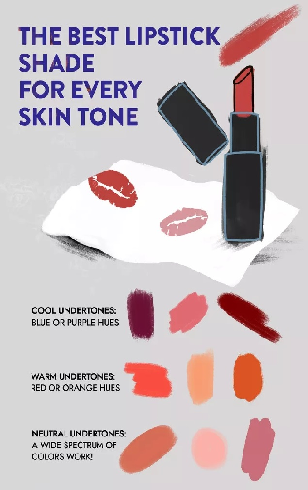

Lipstick or lip stain is a compromise between a finish and long-lasting effect. Lipsticks with a good shine effect will not last long, to counteract this you can use a lip gloss that adds a shine on your lips. Lips glosses can have various finishes, they can be glossy, frosted, matte, metallic and other finishes, they can be transparent and tinted. A special type of lip gloss is lip glitter that creates a glitter-like finish to your lips. Lip glosses can come in solid or liquid form. To apply lip gloss, simply apply it to your lips after you have applied your lipstick or lip stain, then use squeezing/rubbing motion with your lips to spread it evenly.

Note: Most lip makeup products will not last throughout the day, it is common to touch up with your lipstick or lip stain and with your lip gloss multiple times a day to achieve a suitable long-lasting look.

There is a permanent lipstick option available. This is very similar to tattooing and using red pigment to add permanent color to your lips. A specialist will guide you through the process, offer an example of the result you will be getting and adjust it to your needs. Over time the pigment does fade out and you will need to redo the procedure.

# Setting spray

The purpose of setting spray is to create a thin film over your makeup to make sure it stays in place. Setting spray is the last step in your makeup routine. While it can be skipped just like many other steps in your makeup routine, it is still recommended to use a setting spray. This product can sometimes have different names, such as finishing spray or setting mist or other. Setting sprays can contain various ingredients and it is common for them to contain skincare ingredients that hydrate your skin or even target a certain skin concern, for example, acne, but the effect of these ingredients can be very limited since setting spray is the last step in your routine, this means that various powders, liquids and creams are sealing your skin and it is not very likely that these ingredients from your setting spray are going to reach your skin. There are mainly two types of setting sprays and others are something between these two types:
- Matte finish setting spray, suitable for oily skin types, creates a matte finish
- Glossy finish setting spray, suitable for dry skin types, creates a shine

To use a setting spray, simply shake the bottle and then spray in a "X" formation on your face, then follow with a "T" formation. You only need to apply a thin layer of the setting spray. When setting spray is applied, then let it dry. In general, setting sprays don't contain harsh chemicals that could irritate your eyes, but it is advisable to avoid excess setting spray on your eye area.