# Table of Contents
- [Introduction](#Introduction)
- [Face shape](#Face-shape)
- [The look](#The-look)
- [Products](#Products)
- [Primer](#Primer)
- [Color corrector](#Color-corrector)
- [Makeup sponge](#Makeup-sponge)
- [Foundation](#Foundation)
- [Concealer](#Concealer)
- [Highlighter](#Highlighter)
- [Contour](#Contour)

# Introduction
Makeup is more of an art than science, but you can still use some techniques to improve the quality of your makeup application. This guide is going to focus only basic concepts you need to keep in mind when doing your makeup.

Note: While the tips you will find in this guide are general guidelines, they are not rules you must follow. Makeup is a form of art and you can find creative ways on your own.

We are all different and we all have different features on our faces that we might or might not like. The goal of this guide is to give you a basic understanding how you can downplay or highlight a certain feature you have. This guide will cover features that **MOST** people tend to change to achieve a look that tends to match certain criteria. 

Before you start learning about makeup, you should pay a special attention to your skin. This guide will only mention a few concepts that impact your skin's health, it is highly suggested to have a healthy skin before you start doing your makeup. Consider reading the [skincare guide](https://github.com/regdude/skincare/blob/main/README.md). Makeup is very powerful, but if your face is radiant, then doing makeup is much easier and is less likely to cause skin issues. In general, most makeup is going to cause at least some kind of skin concern and hiding skin issues with makeup is **NOT** the correct way. Since a healthy skin is more important than how it looks with makeup, this guide will focus on minimalistic makeup, but this focus can be picked up later for more complex makeup applications.

Note: Makeup application takes time, you should develop your routine so it takes as least time as possible, you should experiment with various methods and find what satisfies your needs and creates a required outcome. Spending an hour on makeup is not desirable, but skipping crucial steps might not also be desirable.

There is a recent trend that started to create skincare infused makeup products, this is somewhat a middle ground, you can give these products a try, but a separate skincare and makeup routine is going to give you the best results. This guide will slightly touch the ingredients on some makeup products to guide you through the vast variety of different kinds of makeup products.

Makeup can get very expensive (same as skincare), but with a little bit of knowledge of what is needed and how it should be used, you should be able to find a product that matches your budget. More expensive products do not mean better quality or better appearance, but it rather means you can achieve a different type of look. Don't go out and buy everything, you should start small and gradually increase the amount of steps you take for your makeup application

# Face shape

The most important thing when starting your makeup journey is to figure out your face shape. There are multiple methods to determine your face, there are even phone apps that does that, consider using them or search for detailed instructions. Determining your face shape can be tricky for some people, there are specialists that can do that for you. If you determine your face shape incorrectly, then your makeup will most likely look very odd. Consider the following image:

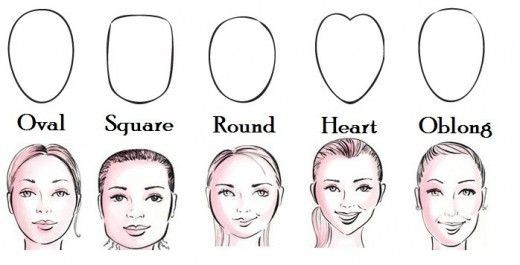

The face shape is very important since it will determine where exactly you are going to use your makeup, but you do still need to keep in mind that there are certain features that some people might want to downplay or highlight that are not very common for your face shape. This is especially true for people that have features of the opposite sex or want to achieve a look that matches the opposite sex, throughout this guide you will find tips on how to enhance or downplay such gender-specific features.

# The look

When you have figured out your face shape, you will most likely be limited to certain looks and it is impossible to even list them all, each makeup artist adds a small variation to the look and creates a completely new look. Small details matter!

Before you go and try to create your own look, consider finding a picture or a video that has that look and pay attention to details. To find a compatible look, consider finding an image/video of a person that has the same features as you do:
- Face shape
- Hair style
- Nose shape
- Eye size
- Eyebrow shape
- Lip shape

Obviously you will not find a clone of yourself online, at least not yet, but you can still find someone that has some features as you do and find another person with other similar features. With this approach you will have an idea of a look you want to achieve and from there it can be just a matter of practice. Makeup has its limits, but it is very powerful when transforming a person, so do some research to find things you like on your own.

In general, there is a certain order how you should apply your makeup, but this is not definitive, you can easily change your makeup application order (to some extent) to achieve a different kind of look. The order you apply your makeup is important, but as long as you follow a few simple principles, you can adjust your look to your own liking. 

# Products

Below you can find a list of products you can use and a little comment what it does (order of the list matches the order you are supposed to apply each product):
- Primer, used to even out the skin's texture to make sure your makeup stays on
- Color corrector, used to hide very noticeable skin's imperfections, most commonly acne
- Makeup sponge, used to blend your makeup
- Foundation, used to even out the skin tone
- Concealer, used to hide skin's imperfections that a foundation cannot hide
- Highlighter, used to make certain areas brighter
- Contour, used to make certain areas darker
- Brushes, makes application of makeup easier, if used properly
- Powders, various powders achieve various look and serves a certain function
- Bronzer, used to make your cheekbones tan-colored
- Blush, used to make your cheekbones flushed-colored
- Eyeliner, used to create a shape around your eyes to enhance the look
- Eyeshadow, used to create a gradual color change on your upper eyelids and eyebrows
- Mascara, used to give your eyelashes more volume
- Eyebrow pencil, used to shape your eyebrows and give them more color
- Lipstick, gives color and certain finish to your lips
- Lipliner, used to give your lips a different shape usually to make them look bigger
- Setting spray, used to make sure your makeup stays in place

Note: Most of these products are optional and some of them can be replaced with other products or combined products. The bare minimum usually is foundation, some contour along with highlighter, mascara, but even these products can be skipped or replaced, it is all based on personal preference and requirements.

Follow the guide to understand how each type of product can give you a certain result and how some of these products can be replaced with a different kind of products. Some products are not listed since they fall into one of the listed products, but there are some special products that don't fall in any category.

Note: Some people use certain products for a complete different purpose, you should keep in mind that makeup is less about functionality and more about appearance and for this reason you can play with the colors of the products more than their functionality. For example, you can even use eyeshadow to contour your face, but it will have some drawbacks. You will find such possibilities throughout the guide.

# Primer

Primers are the first step of the makeup process, the purpose is to level out small bumps and imperfections on your skin to make the skin as smooth as possible. This is usually done with products that contain silicone, but other ingredients also achieve this effect, silicones are the most common ingredient in primers. If you apply primer on your skin, you can expect your makeup to stay on longer, this is useful if you need your makeup to stay on the whole day.

It is possible to skip the primer, but without a primer it might be harder to put on your makeup and it will not stay on for very long period of time. Primer is not needed for everyone, most people will be using a sunscreen, they usually contain silicones and therefore can be used as primers for your makeup too. If your sunscreen does not contain silicones, then you can still experiment without using a primer since there are other ingredients that have similar properties.

If you do want to achieve the best possible makeup, then you should use a primer. Follow the instructions on your primer's packaging, but usually it involves getting a few drops of the liquid and rubbing it on your face, usually there is no need to wait for it to settle down. Some primers can be used on your eye area, but some can be too harsh. Read the instructions of your specific primer to make sure it can be used on eye area.

There are special eyelid primers that are specifically meant to be used on the eye area, but you don't have to get a dedicated primer for your eye area, if your face primer can be used on eye area. Consider getting a primer that is safe for eyes in the first place. Without priming your eye area, there is a large chance that your eye makeup will not stay on.

# Color corrector

While primer creates a smooth surface, it does not hide visual skin imperfections. Color correctors are used to hide some very noticeable imperfections, usually acne or hyperpigmentation that foundation nor concealer can hide, a color corrector is a concealer with more noticeable colors. The color of the corrector indicates its primary usage. Consider the following list:
- Green, hides redness on your skin, usually acne
- Orange, helps to conceal uneven skin tone for darker skin colors, especially for dark circles under eyes
- Pink, help to conceal dark circles under eyes for lighter skin colors
- Yellow, helps to hide veins, bruises and undereye circles
- Purple, helps to even out very dull skin complexion

Use the following diagram to decide what color corrector you need:

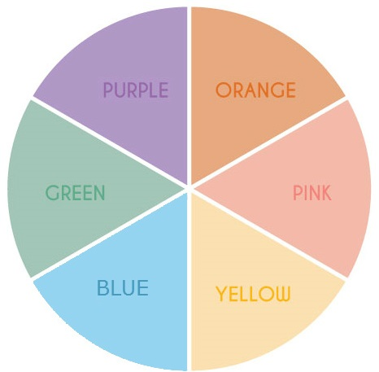

*TIP:* A pink or red color corrector can be used to conceal beard shadow and make it a lot less visible.

Color correctors come in liquid or powder form. Liquid color correctors will tend to have better coverage, but powder form color correctors might be more forgiving for acne. A liquid color corrector does not need any brushes (though you can use brushes too), but powder color correctors need brushes.

To apply a color corrector, first determine the required color to counteract the skin's imperfection color. For example, if you want to hide a few red pimples, then use a green color corrector, apply a small amount on that area and use your fingers or a makeup sponge to blend in the color corrector to match your skin as best as you can. Don't worry about it not being perfect because you are going to hide small imperfections later.

# Makeup sponge

While you can apply makeup without any brushes or sponges, the makeup sponge is almost critical to your makeup. The purpose of makeup sponge is to blend your makeup, but you will soon notice that using fingers to blend your makeup has a very limited effect, this is where a makeup sponge can be a gamechanger, some consider it as the most valuable tool in makeup. Consider getting just about any makeup sponge, the price will not matter much, as long as it looks something like this:

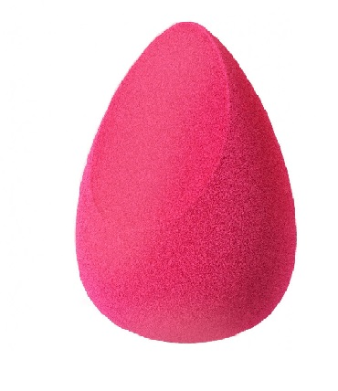

There are multiple types and varieties of this tool, but this guide will cover only this (the most common) version of the makeup sponge. To use the makeup sponge, pick it up, wet it a little bit so it is just slightly damp, so simply squeeze out any excess water. Do a "Dot&Dab" motion on the areas you want to blend, start by "dotting" your makeup into your skin, especially into hard to reach areas (like your eye corners), then you can use a "dabbing" motion on larger areas to give the makeup an overall natural look. Consider looking up videos that show the usage of this tool, a video example will be given further in this guide.

Note: There are other motions that you can use, for example, a circular motion starting from the middle on your face. The direction and motion you choose to use can make a big difference to the overall look. Experiment with various motions to see which one works for you the best.

**IMPORTANT:** These makeup sponges do get dirty, consider washing them with soap frequently. Not only a dirty makeup sponge can ruin your look, but it can also cause you acne.

Usually the makeup sponges have a teardrop shape, this is on purpose. The rounded bottom area is used to blend large areas, for example, your cheekbones. The flat tip area is used to blend very hard to reach areas, for example, the inner eye corners. The rounded tip area is used to blend somewhat hard to reach areas, for example, undereye area. If you find areas, where you cannot seem to blend or you cannot seem to get a proper blend, then consider looking for a different shape of makeup sponge, each shape has benefits and drawbacks.

# Foundation

Foundation is considered as the base for your makeup, it has the purpose to make your skin as even as possible to hide small imperfections and create a general skin tone, in fact you can use foundation to change your skin tone to some extent. The most difficult part of choosing a foundation is to "guess" your skin tone, sadly most companies use their own numbering and naming methods so there is no foolproof way to determine the color of the foundation you need to use. Luckily you don't need to get it perfectly right, this is where the makeup sponge comes in handy as it can blend your makeup to match your skin, especially the areas where your foundation is not used, for example, neck.

The way you are supposed to choose your foundation is to go to a store and place a small amount on your skin (preferably on your face since skin tone for your face and body can be different) and check the mirror. If it matches your skin color, then you have a match, otherwise it might look odd on you unless you are going for a look that changes your skin tone. Buying online can be very tricky, some stores offer you to receive samples or some kind of chart, but other than that you simply must make the closest guess you can, do remember that printing out the chart or looking at the chart on your monitor does not give a perfect color representation, the actual color on your skin can (and most likely will) be different.

Note: Many people use BB creams or tinted sunscreens to hide their skin imperfections, these people can skip using a foundation, but these creams have a limited coverage, you will achieve a noticeably better coverage with a dedicated foundation.

Foundations come in liquid and powder form. Similar to color correctors, liquid foundations tend to give you more coverage, but powder foundation tends to be more forgiving to acne. They do create different types of looks too. Their application method does differ so read on to find which method you should use. There are also mousse, stick and cream (BB/CC), these foundations are similar to liquid foundation and their application method does not differ much, consider using mousse foundation if you are a beginner and want to  

Liquid foundations can be applied by simply adding a small amount on your palms and rubbing it on your face. Try not to use too much foundation and don't worry about getting a perfect coverage either, that is where the next product is going to be useful. Similar to color correctors, you should use a makeup sponge to blend in your makeup, focus on the areas, where foundation ends, usually the neck area. Blend these edges as best as you can with a makeup sponge so the transition looks even. Use the makeup sponge to blend the foundation starting from the center of the face to outwards of the face, this will create a more natural look.

Powder foundation can be applied using a foundation brush, use your brush rub in a small amount of foundation powder and apply to your face in circular motions. Start from the center of the face and gradually move in circular motions outwards of the face. This will create an even and natural look. You can use the makeup sponge to blend any sharp edges you might have.

You can achieve different kinds of looks with just the foundation, there are 3 main types of foundation finishes (and more types that fall somewhere between them), the following list describes the effect of each finish:
- Matte finish, create a smooth, shine-free finish, sometimes contain sebum regulating ingredients
- Dewy finish, create a glowy, natural, radiant finish, usually contain hydrating ingredients
- Luminous finish, a finish between matte and dewy

While you can choose any type of finish, it is highly recommended to choose the finish based on your skin type. Oily skin type should use a matte finish since the skin tends to create excess sebum and create extra shine for the face. Dry skin type should use a dewy finish to add a little bit of shine and hydration. Luminous finish would work the best for normal skin type. Liquid foundations tend to be with dewy or luminous finish, but powder foundations tend to be with a matte finish. 

Note: You can use a little more foundation on areas, where you need extra coverage. Men would benefit of using more foundation on their beard area to hide beard shadow.

# Concealer

Foundation is used to give a general coverage to hide skin imperfections, but sometimes it is not enough and you need extra coverage. This is where concealer comes is, which is meant to hide more difficult imperfections. It is possible to apply a concealer before foundation, just like you would do with a color corrector, which is a concealer, but the general practice is to apply it after the foundation to reduce the chance of your makeup looking "cakey", which simply looks uneven. There are multiple types of concealers, but you should be aware of the following ones:
- Liquid concealer
- Cream concealer
- Powder concealer
- Stick concealer

Liquid and cream concealers are similar to liquid foundations when it comes to application, cream concealers are thicker and offer more coverage, you will need to blend the concealer using a makeup sponge just like you would with a liquid foundation, a concealer brush can be used to achieve more precision. Powder concealers are applied the same way powder foundation is, but a concealer brush should be used. Stick concealers can be a great tool for those, who don't use much makeup, they can be a very quick fix for your skin imperfection, they come in a lipstick-like shape and can be easily applied by coloring a certain area.

Most commonly foundation is going to be enough to cover most imperfections, but concealer is more commonly used to brighten your face, this is a task for a different product in your makeup routine (the highlighter), but concealer can also be used and seems to be a preferred choice for most people since a highlighter might not give enough coverage to hide dark undereye circles. For the reason mentioned, concealer should be used to achieve a very common look, where your eyes seem bright and youthful. Use the following image to correctly apply liquid concealer, though you can use this guideline for powder concealer as well:

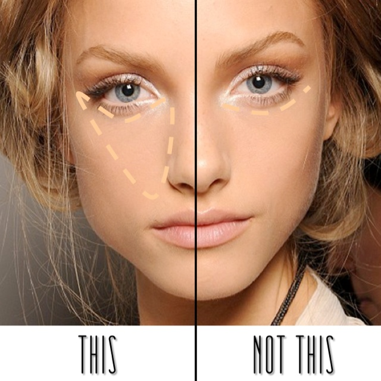

From the image above you can conclude that you should form a triangle shape to achieve a youthful look, but pay attention that the concealer is placed on dot form, this is intentional to make sure you use less concealer, from there you can spread the concealer and then blend it in. You might need to use a bit more concealer on the undereye area, if you have dark circles under your eyes.

There are some areas on your face that you may wish to downplay. This is something a highlighter does, but a concealer can be used too. We are not going to cover these areas just yet, but they will be explained along with the effects a highlighter can make. For now, remember that you can try to replace either partially or fully your highlighter with a concealer since concealers will tend to be a little brighter than your foundation.

Note: You don't have to fully blend the concealer in when you apply it, but you do want to smear liquid concealers a bit so they have the proper shape you are after. You can fully blend everything after you are done contouring.

# Highlighter

Note: Highlighting is considered as a part of contouring, where you shape your face, but in scope of this guide highlighting is going to be separate since here we are going to discuss a downplaying feature of the highlighter that can be used to create more feminine effect for a face that deserves a separate chapter.

The purpose of a highlighter is to highlight, this is done by making a area brighter than your parts of the face, but this effect has another feature that can be used. Highlighting is a part of contouring and how to highlighting your face to compliment its shape is going to be discussed in the contouring chapter, here we are going to discuss downplaying certain features that you might want into your look. When highlighter makes an area brighter, it also makes this area look shorter (along with strategically placed darker areas), this feature of a highlighter is very useful for those who want to appear more feminine.

Note: Some of the areas you might want to highlight can overlap with areas that you are supposed to contour to compliment your face shape, this can create an adverse effect, but sometimes it can cancel out the effect of an unwanted feature as well. Experiment with various techniques to see what looks best on you.

Below you will find various techniques you can use to transform your face, ignore the face shape because taking the face shape into account right now is going to be too complex. The white dots represent areas, where you are supposed to use a highlighter to achieve a look.

The T-zone for males is more outwards, some females have a sharp curve on the T-zone, you can use a highlighter on this area to make the area appear smoother therefore more feminine:

The eyes for a male are usually smaller and more inward, this creates a sharper edge and creates a masculine look. Highlighter can be used to make this area appear smoother and make your eyes look larger:

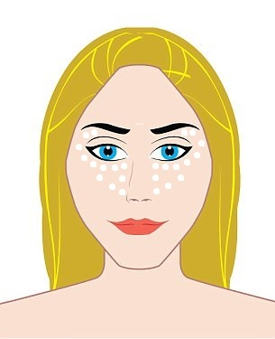

Females tend to have a bit shorter area between lips and nose, highlighter can be used to shorten this area for those, who might have a larger gap between nose and lips:

Males tend to have a more pronounced chin area, especially the chin dip, highlighter can be used to make this area look less sharp:

Female cheekbones tend to be more plump, highlighter can be used just right under your real cheekbones to make them appear more plump, do keep in mind that this area requires more contouring to have full effect:

The nose is probably the most common complaint for females and they wish to make it appear smaller, highlighter can be a very powerful way to downplay the size of a nose, but it requires some more contouring to fully have the effect, for now keep in mind that you need to add highlighter to the sides of the nose and just a thin line in the middle of the nose:

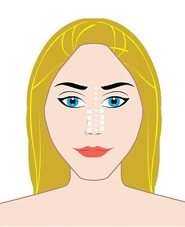

Note: You can use a concealer to highlight these areas instead of a dedicated highlighter, but you might still benefit from using a highlighter on some areas since highlighters tend to be more reflective and therefore can have even more pronounced effect when it comes to downplay a feature.

There are multiple types of highlighters and each has its own advantages, here are only some of the most popular types:
- Stick highlighters, best for total beginners, simply draw the highlighter where ever you desire
- Pressed highlighters, these come in a set of multiple shades of a highlighter, can get you the most skin tone matching color
- Powder highlighter, lightweight powder usually used for a finishing touch of highlighter
- Liquid highlighter, the most common one and gives you the most color contrast

You might even be using two types of highlighters to achieve even more advanced makeup. You have be option to use, for example, liquid highlighter to downplay some of your facial features after you have used concealer or foundation, but then you apply a finishing touch with a powder highlighter after you have used setting powder.

Note: Some types of highlighters can be applied with just your fingers, but some require a brush, for example, a powder highlighter. You can use a contour brush to apply the highlighter, but for powder highlighter you might want to use a special fan brush.

# Contour
 
Note: In the scope of this guide, a contour is makeup product that creates darker areas on your face, but contouring is a technique that sculpts your face using both a highlighter and a contour. The actual product used for creating a darker shade can be almost anything that has such a color, similar to a highlighter you can even use a darker concealer. There does not seem to be a universal name for both contour and highlighter that is widely used, so be aware that a contour/highlighter can be anything that has color and sticks to your face. In this guide we will simply refer to a highlighter as something with a lighter color and refer to a contour as something with a darker color, these names might not match whatever your are searching for, but the actual process name (contouring) is used quite universally.

Along with highlighter, a contour is arguably the most powerful makeup tool that can change your look so drastically that you might not recognize yourself anymore. The idea of contouring is to create a visual illusion of facial features. When highlighter is strategically placed next to a contour, it can create a very powerful sculpting effect and this ability is crucial when achieving a certain look.

There is a certain standard when it comes to contouring, this is directly linked to your face shape, the majority will agree that longer faces should be made to appear shorter, diamond shaped faces should have a narrower forehead, square faces should be made rounder and so on. Luckily for you, there are countless guides that specifically target a certain face shape when it comes to contouring. To get an idea how to place both your highlighter and your contour, check the image bellow (darker areas are contour and lighter areas are highlighter):

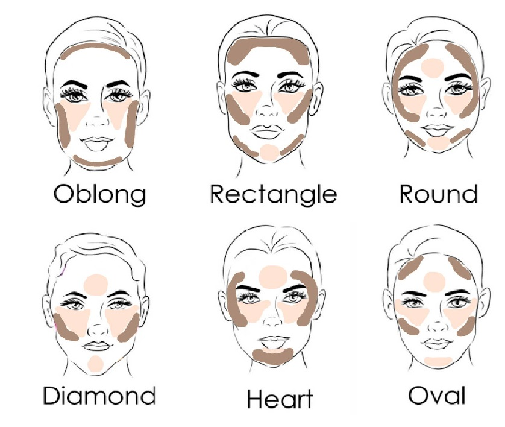

Note: These diagrams tend to be very contradicting when it comes to the contour placement, it is best to experiment with various contouring methods.

As you might notice, some of the previous mentioned highlighting methods to hide certain facial features are conflicting with contouring methods, this is something you need to pay attention since it can disrupt the overall look for your makeup. Also, this is diagram is not a rule for all makeup applications, this is only a guideline. You might find that you want to sculpt your face differently in order to match your hair style, for example. You can use contouring spots from different face shapes and create your own sculpting guideline.

*TIP:* It is highly recommended that you look up a makeup tutorial video that is meant for your face shape contouring, for example, search for "oval face makeup contouring". You can find a large amount of tips about contouring that is specific to your face shape.

Most contouring guidelines will advise you to create a "triangle" shape on your cheekbones, this is a very powerful method that will arguably create the biggest different to your look since it has the power to create an illusion of the length of a face and its overall shape. This "triangle" is a bit hard to master since there are multiple ways to draw it, in general the triangle starts from your mouth area and goes up to your ears, but adjusting the length and height of the triangle can change the look dramatically.

To correctly draw the "triangle", you must first understand what exactly changes when you place the "triangle" on your face. The "triangle" will create an effect that will make your face look either long or shorter and you should adjust the triangle based on your needs.

To shorten your face, you need to draw the triangle starting from the top of your ear, point to the very end of your nostril and end up somewhere in the middle (or bottom) of your ear. The triangle should end somewhere in the middle of your eyes. Sometimes this is done with a bronzer and applied with a sweeping motion towards the middle of the face, but this can be done with any product that acts as a contour. The thickness of the "triangle" will also have an effect (hence the option to choose the points on your ear), a narrower contour line will appear to have less effect than a thicker "triangle", you must choose the thickness of the "triangle" based on how much you want to sculpt your face. Check the image bellow:

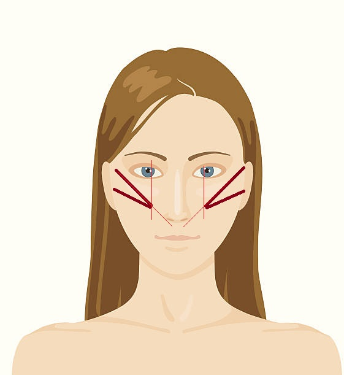

To elongate your face, you need to draw the triangle starting from the middle (or top) of your ear, point to the very end of your mouth and end up to the bottom of your ear. The triangle should end somewhere in the middle of your eyes. Check the image bellow:

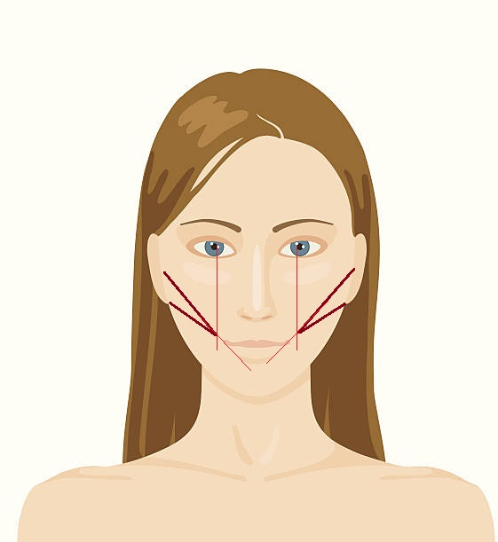

Note: Elongating the face might not be suitable for diamond shaped faces since this method will accentuate the small chin even more.

Similar to highlighter, almost anything can be used as contour. As long as it has a darker shade, it can be used for sculpting your face. While bronzers and blushes can be used, they deserve a separate section as contouring with them is a bit different. For contouring you can use a concealer, foundation, eyeshadow and most likely some other products. The application method will depend on the type of product, but in general liquid type of contour should be put on in forms of dots and then smeared to fill the shape, powdered types of contour should be put on using brushes.

One of the hardest things to master is to contour the nose. The common practice is to make the nose appear smaller, this can be done by strategically placing highlighter and contour. To make your nose appear smaller, you apply a thin line of highlighter in the middle of the nose, then draw 2 contour lines on the front of the nose. The darker lines will create an illusion that the nose ends faster, as a result the nose appears narrower. Do note that this only creates an effective illusion from the front view, not from the sides. Check the image bellow:

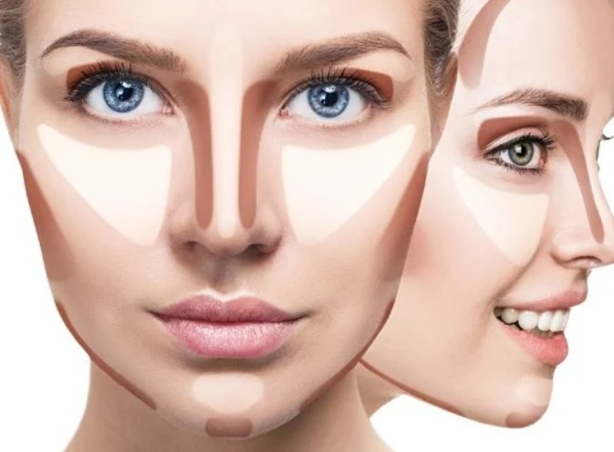

Note: This is the most common way most people contour their nose, based on your nose shape it might not be the best way. The straight lines on both sides will make your nose appear longer, check the guide further to learn more about nose sculpting using makeup.

*TIP:* You can enhance the effect of making nose more narrow by spreading the highlighter from the undereye area up to the sides of the nose to almost meet with contour lines on your nose. This can make your nose appear even narrower.

The shape of the nose is quite unique to everyone, in general you want to make it look smaller, but there are other characteristics that you might want to downplay or maybe even enhance. Consider the following image to follow how to contour your nose based on its shape:

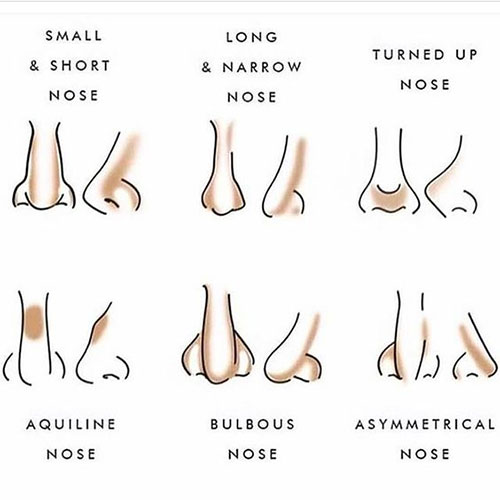

When you have placed your highlighters and contours where you want them, then it is time to blend it all in. The process how to use it has already been discussed in this guide, but as a refresher, you are supposed to use slightly damp makeup sponge and using dotting and dabbing motions to blend the makeup together. Here is a video example that shows the process in quite good details:

